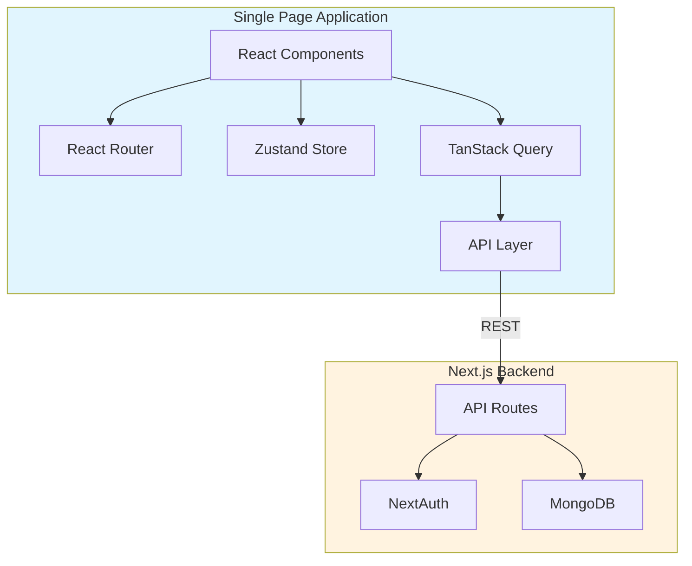
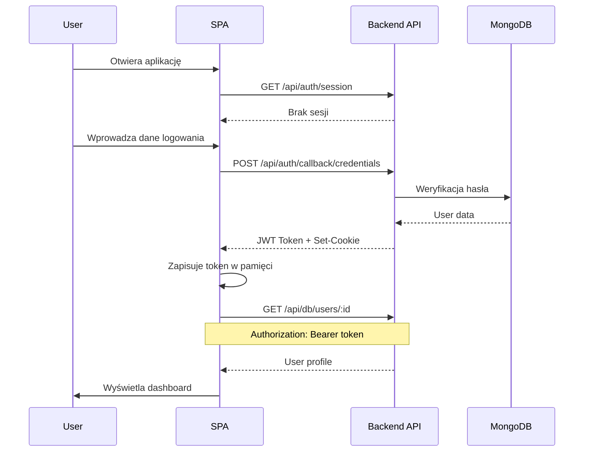

# Plan przepisania modułu Athlete do Single Page Application

---

## 📊 AKTUALNY STAN PROJEKTU (Aktualizacja: 2026-01-21 03:50)

### Postęp ogólny: ~50%

| Faza | Status | Postęp |
|------|--------|--------|
| Faza 1: Konfiguracja projektu | ✅ Ukończona | 100% |
| Faza 2: Warstwa API | ✅ Ukończona | 100% |
| Faza 3: System autentykacji | 🔄 W trakcie | 80% |
| Faza 4: Layout i nawigacja | 🔄 W trakcie | 60% |
| Faza 5: Konteksty i stan globalny | 🔄 W trakcie | 60% |
| Faza 6: Komponenty UI | 🔄 W trakcie | 50% |
| Faza 7: Komponenty specjalistyczne | 🔄 W trakcie | 10% |
| Faza 8: Implementacja stron | 🔄 W trakcie | 25% |
| Faza 9: Hooki specjalistyczne | ⏳ Oczekuje | 0% |
| Faza 10: Integracje zewnętrzne | ⏳ Oczekuje | 0% |
| Faza 11: Optymalizacja | ⏳ Oczekuje | 0% |

### Utworzone pliki:

```
SPA/
├── package.json              ✅
├── tsconfig.json             ✅
├── vite.config.ts            ✅
├── tailwind.config.ts        ✅
├── index.html                ✅
├── .env.example              ✅
└── src/
    ├── main.tsx              ✅
    ├── App.tsx               ✅ (routing dla 26 stron + ActiveWorkoutProvider)
    ├── index.css             ✅
    ├── vite-env.d.ts         ✅
    ├── config/env.ts         ✅
    ├── lib/utils.ts          ✅
    ├── api/
    │   ├── client.ts         ✅ (axios z interceptorami)
    │   ├── auth.ts           ✅
    │   ├── db.ts             ✅ (CRUD operations)
    │   ├── gamification.ts   ✅
    │   └── upload.ts         ✅
    ├── hooks/
    │   ├── index.ts          ✅
    │   ├── useCollection.ts  ✅
    │   ├── useDoc.ts         ✅
    │   └── useMutation.ts    ✅ (useCreateDoc, useUpdateDoc, useDeleteDoc)
    ├── types/index.ts        ✅ (pełne typy: Workout, Exercise, Goal, etc.)
    ├── contexts/
    │   ├── AuthContext.tsx   ✅
    │   ├── UserProfileContext.tsx ✅
    │   └── ActiveWorkoutContext.tsx ✅ (NEW)
    ├── components/
    │   ├── theme-provider.tsx ✅
    │   ├── layout/
    │   │   ├── AthleteLayout.tsx  ✅
    │   │   ├── AppNav.tsx         ✅
    │   │   ├── BottomNav.tsx      ✅
    │   │   └── ProtectedRoute.tsx ✅
    │   ├── shared/
    │   │   ├── WorkoutsListView.tsx ✅
    │   │   └── exercises/           ✅ (NEW)
    │   │       ├── index.ts
    │   │       ├── types.ts
    │   │       ├── ExercisesListView.tsx
    │   │       ├── ExerciseCardHorizontal.tsx
    │   │       └── ExerciseFilters.tsx
    │   └── ui/
    │       ├── alert.tsx         ✅
    │       ├── alert-dialog.tsx  ✅
    │       ├── avatar.tsx        ✅
    │       ├── badge.tsx         ✅
    │       ├── button.tsx        ✅
    │       ├── card.tsx          ✅
    │       ├── checkbox.tsx      ✅
    │       ├── dialog.tsx        ✅
    │       ├── dropdown-menu.tsx ✅ (NEW)
    │       ├── input.tsx         ✅
    │       ├── label.tsx         ✅
    │       ├── progress.tsx      ✅
    │       ├── select.tsx        ✅
    │       ├── separator.tsx     ✅
    │       ├── skeleton.tsx      ✅
    │       ├── sonner.tsx        ✅
    │       ├── tabs.tsx          ✅
    │       └── textarea.tsx      ✅
    └── pages/
        ├── auth/
        │   ├── LoginPage.tsx     ✅
        │   └── RegisterPage.tsx  ✅
        └── athlete/
            ├── DashboardPage.tsx     ✅ (pełna implementacja)
            ├── WorkoutsPage.tsx      ✅ (pełna implementacja)
            ├── WorkoutDetailPage.tsx ✅ (pełna implementacja)
            ├── ExercisesPage.tsx     ✅ (pełna implementacja)
            ├── HistoryPage.tsx       ✅ (pełna implementacja)
            ├── HistoryDetailPage.tsx ✅ (pełna implementacja)
            ├── ProfilePage.tsx       ✅ (pełna implementacja)
            ├── GoalsPage.tsx         ✅ (pełna implementacja)
            └── [13 placeholder pages] 🔄
```

### Uruchomienie projektu:

**1. Uruchom backend Next.js (w głównym katalogu projektu):**
```bash
npm run dev
```
Backend będzie dostępny na `http://localhost:3000`

**2. Uruchom SPA (w katalogu SPA/):**
```bash
cd SPA
npm run dev
```
SPA będzie dostępne na `http://localhost:5173`

**Ważne:** Backend musi być uruchomiony przed SPA, ponieważ SPA używa proxy Vite do przekierowania żądań `/api/*` do backendu.

### Następne kroki:
1. Dokończyć hooki API (useCollection, useDoc, etc.)
2. Zaimplementować pozostałe komponenty shadcn/ui
3. Pełna implementacja stron athlete (obecnie placeholdery)
4. Testowanie integracji z backendem

---

## 1. Przegląd projektu

### 1.1 Cel
Przepisanie modułu athlete z aplikacji Next.js do standalone Single Page Application, która będzie komunikować się z obecnym backendem przez REST API.

### 1.2 Zakres funkcjonalności do zaimplementowania

#### Strony publiczne (autentykacja)
- `/login` - logowanie użytkownika
- `/register` - rejestracja nowego użytkownika

#### Strony chronione (moduł athlete)
| Ścieżka | Opis |
|---------|------|
| `/athlete/dashboard` | Panel główny sportowca |
| `/athlete/calendar` | Kalendarz treningowy |
| `/athlete/chat` | Czat z trenerem |
| `/athlete/exercises` | Baza ćwiczeń |
| `/athlete/gamification` | System osiągnięć i nagród |
| `/athlete/goals` | Cele treningowe |
| `/athlete/habits` | Nawyki użytkownika |
| `/athlete/history` | Historia treningów |
| `/athlete/history/:sessionId` | Szczegóły sesji treningowej |
| `/athlete/knowledge-zone` | Strefa wiedzy - artykuły |
| `/athlete/knowledge-zone/:articleId` | Szczegóły artykułu |
| `/athlete/knowledge-zone/manage` | Zarządzanie artykułami |
| `/athlete/log` | Logowanie aktywnego treningu |
| `/athlete/map` | Mapa siłowni |
| `/athlete/measurements` | Pomiary ciała |
| `/athlete/profile` | Profil użytkownika |
| `/athlete/onboarding` | Kreator onboardingu |
| `/athlete/running` | Sesje biegowe |
| `/athlete/social` | Ściana społecznościowa |
| `/athlete/templates` | Szablony treningowe |
| `/athlete/workout-plans` | Plany treningowe |
| `/athlete/workouts` | Lista treningów |
| `/athlete/workouts/:id` | Szczegóły treningu |
| `/athlete/workouts/:id/edit` | Edycja treningu |
| `/athlete/workouts/create` | Tworzenie nowego treningu |

---

## 2. Architektura techniczna

### 2.1 Stos technologiczny SPA

```
┌─────────────────────────────────────────────────────────────┐
│                    SPA - Athlete Module                      │
├─────────────────────────────────────────────────────────────┤
│  Framework:        React 19 + Vite                          │
│  Routing:          React Router v7                          │
│  State:            Zustand / TanStack Query                 │
│  UI Components:    shadcn/ui (przeniesione z Next.js)       │
│  Styling:          Tailwind CSS 4                           │
│  Forms:            React Hook Form + Zod                    │
│  HTTP Client:      Axios lub fetch                          │
│  Auth:             JWT tokens stored in httpOnly cookies    │
└─────────────────────────────────────────────────────────────┘
                              │
                              │ REST API
                              ▼
┌─────────────────────────────────────────────────────────────┐
│              Existing Next.js Backend                        │
├─────────────────────────────────────────────────────────────┤
│  API Routes:       /api/db/:collection                      │
│  Auth:             /api/auth (NextAuth)                     │
│  Uploads:          /api/upload                              │
│  Gamification:     /api/gamification                        │
│  Other endpoints:  /api/*                                   │
└─────────────────────────────────────────────────────────────┘
```

### 2.2 Struktura folderów SPA

```
SPA/
├── public/
│   ├── favicon.ico
│   └── assets/
├── src/
│   ├── main.tsx                    # Entry point
│   ├── App.tsx                     # Root component z routingiem
│   ├── index.css                   # Globalne style (Tailwind)
│   │
│   ├── api/                        # Warstwa komunikacji z API
│   │   ├── client.ts               # Konfiguracja axios/fetch
│   │   ├── auth.ts                 # Endpointy autentykacji
│   │   ├── db.ts                   # Generyczne operacje CRUD
│   │   ├── gamification.ts         # API gamifikacji
│   │   └── upload.ts               # Upload plików
│   │
│   ├── components/                 # Komponenty UI
│   │   ├── ui/                     # shadcn/ui components
│   │   ├── layout/                 # Layout components
│   │   │   ├── AppHeader.tsx
│   │   │   ├── AppNav.tsx
│   │   │   ├── BottomNav.tsx
│   │   │   └── ProtectedRoute.tsx
│   │   ├── chat/                   # Komponenty czatu
│   │   ├── gamification/           # Komponenty gamifikacji
│   │   ├── onboarding/             # Komponenty onboardingu
│   │   ├── profile/                # Komponenty profilu
│   │   ├── social/                 # Komponenty społecznościowe
│   │   ├── workout/                # Komponenty treningów
│   │   └── shared/                 # Wspólne komponenty
│   │
│   ├── contexts/                   # React Contexts
│   │   ├── AuthContext.tsx
│   │   ├── UserProfileContext.tsx
│   │   └── ActiveWorkoutContext.tsx
│   │
│   ├── hooks/                      # Custom hooks
│   │   ├── useAuth.ts
│   │   ├── useCollection.ts
│   │   ├── useDoc.ts
│   │   ├── useMutation.ts
│   │   ├── useActiveWorkout.ts
│   │   ├── useGamification.ts
│   │   └── ...
│   │
│   ├── pages/                      # Strony aplikacji
│   │   ├── auth/
│   │   │   ├── LoginPage.tsx
│   │   │   └── RegisterPage.tsx
│   │   └── athlete/
│   │       ├── DashboardPage.tsx
│   │       ├── CalendarPage.tsx
│   │       ├── ChatPage.tsx
│   │       ├── ExercisesPage.tsx
│   │       ├── GamificationPage.tsx
│   │       ├── GoalsPage.tsx
│   │       ├── HabitsPage.tsx
│   │       ├── HistoryPage.tsx
│   │       ├── HistoryDetailPage.tsx
│   │       ├── KnowledgeZonePage.tsx
│   │       ├── ArticleDetailPage.tsx
│   │       ├── KnowledgeManagePage.tsx
│   │       ├── LogPage.tsx
│   │       ├── MapPage.tsx
│   │       ├── MeasurementsPage.tsx
│   │       ├── ProfilePage.tsx
│   │       ├── OnboardingPage.tsx
│   │       ├── RunningPage.tsx
│   │       ├── SocialPage.tsx
│   │       ├── TemplatesPage.tsx
│   │       ├── WorkoutPlansPage.tsx
│   │       ├── WorkoutsPage.tsx
│   │       ├── WorkoutDetailPage.tsx
│   │       ├── WorkoutEditPage.tsx
│   │       └── WorkoutCreatePage.tsx
│   │
│   ├── store/                      # State management (Zustand)
│   │   ├── authStore.ts
│   │   ├── workoutStore.ts
│   │   └── uiStore.ts
│   │
│   ├── types/                      # TypeScript types
│   │   ├── index.ts
│   │   ├── user.ts
│   │   ├── workout.ts
│   │   ├── exercise.ts
│   │   └── ...
│   │
│   ├── lib/                        # Utilities
│   │   ├── utils.ts
│   │   ├── set-templates.ts
│   │   └── set-type-config.ts
│   │
│   └── config/
│       └── env.ts                  # Environment variables
│
├── index.html
├── vite.config.ts
├── tailwind.config.ts
├── postcss.config.js
├── tsconfig.json
├── package.json
└── .env.example
```

---

## 3. Szczegółowy plan implementacji

### Faza 1: Konfiguracja projektu ✅ UKOŃCZONA

- [x] Inicjalizacja projektu Vite z React + TypeScript
- [x] Konfiguracja Tailwind CSS 4
- [x] Konfiguracja React Router v7
- [x] Instalacja i konfiguracja shadcn/ui (podstawowe komponenty)
- [x] Konfiguracja aliasów ścieżek w tsconfig
- [x] Utworzenie pliku .env.example i konfiguracji środowiskowej
- [x] Konfiguracja ESLint (wbudowana w Vite)
- [x] Utworzenie struktury folderów projektu
- [x] Konfiguracja proxy do backendu w vite.config.ts
- [x] Build projektu zakończony sukcesem

### Faza 2: Warstwa API 🔄 W TRAKCIE

- [x] Utworzenie klienta HTTP z interceptorami (`src/api/client.ts`)
- [x] Implementacja obsługi tokenów JWT (interceptory w client.ts)
- [x] Utworzenie podstawowych funkcji CRUD (`src/api/db.ts`):
  - [x] fetchCollection - pobieranie kolekcji
  - [x] fetchDocument - pobieranie pojedynczego dokumentu
  - [x] createDocument - tworzenie dokumentów
  - [x] updateDocument - aktualizacja dokumentów
  - [x] deleteDocument - usuwanie dokumentów
- [x] Integracja z TanStack Query dla cache i stanu serwera
- [x] Utworzenie API dla autentykacji (`src/api/auth.ts`)
- [ ] Migracja hooków z db-hooks.tsx jako React hooks:
  - [ ] useCollection - hook do pobierania kolekcji
  - [ ] useDoc - hook do pobierania pojedynczego dokumentu
  - [ ] useCreateDoc - hook do tworzenia dokumentów
  - [ ] useUpdateDoc - hook do aktualizacji dokumentów
  - [ ] useDeleteDoc - hook do usuwania dokumentów
- [ ] Utworzenie API dla gamifikacji
- [ ] Utworzenie API dla uploadu plików

### Faza 3: System autentykacji 🔄 W TRAKCIE

- [x] Implementacja AuthContext (`src/contexts/AuthContext.tsx`)
- [x] Implementacja strony logowania (`src/pages/auth/LoginPage.tsx`)
- [x] Implementacja strony rejestracji (`src/pages/auth/RegisterPage.tsx`)
- [x] Implementacja ProtectedRoute HOC (`src/components/layout/ProtectedRoute.tsx`)
- [x] Implementacja wylogowania (w AuthContext)
- [x] Obsługa przekierowań po zalogowaniu
- [ ] Obsługa refresh tokenów
- [ ] Testowanie integracji z backendem

### Faza 4: Layout i nawigacja 🔄 W TRAKCIE

- [x] Migracja komponentu nawigacji bocznej - AppNav (`src/components/layout/AppNav.tsx`)
- [ ] Migracja komponentu nagłówka - AppHeader
- [x] Migracja komponentu nawigacji dolnej - BottomNav (`src/components/layout/BottomNav.tsx`)
- [ ] Implementacja SidebarProvider dla responsywności (wymaga pełnej migracji shadcn/ui Sidebar)
- [x] Implementacja ThemeProvider dla dark/light mode (`src/components/theme-provider.tsx`)
- [x] Implementacja layoutu głównego dla athlete (`src/components/layout/AthleteLayout.tsx`)

### Faza 5: Konteksty i stan globalny 🔄 W TRAKCIE

- [x] Migracja UserProfileContext (`src/contexts/UserProfileContext.tsx`)
- [ ] Migracja ActiveWorkoutContext
- [ ] Implementacja Zustand store dla UI
- [ ] Implementacja obsługi onboardingu

### Faza 6: Komponenty UI - shadcn/ui 🔄 W TRAKCIE

Migracja wszystkich komponentów z /components/ui/:

**Zaimplementowane:**
- [x] Button (`src/components/ui/button.tsx`)
- [x] Card (`src/components/ui/card.tsx`)
- [x] Input (`src/components/ui/input.tsx`)
- [x] Label (`src/components/ui/label.tsx`)
- [x] Sonner/Toast (`src/components/ui/sonner.tsx`)

**Do zaimplementowania:**
- [ ] Accordion, Alert, AlertDialog
- [ ] Avatar, Badge
- [ ] Calendar, Carousel
- [ ] Chart, Checkbox, Collapsible
- [ ] Combobox, Command, Dialog
- [ ] Dropdown, Form
- [ ] Menubar, MultiSelect
- [ ] Popover, Progress, RadioGroup
- [ ] ScrollArea, Select, Separator
- [ ] Sheet, Sidebar, Skeleton
- [ ] Slider, Switch
- [ ] Table, Tabs, Textarea
- [ ] Toaster, Tooltip

### Faza 7: Komponenty specjalistyczne

#### 7.1 Komponenty czatu
- [ ] ChatLayout
- [ ] ChatView
- [ ] ConversationList
- [ ] MessageInput
- [ ] MessageList
- [ ] NewConversationDialog
- [ ] QuickChatWidget

#### 7.2 Komponenty gamifikacji
- [ ] AchievementNotification
- [ ] AchievementsGrid
- [ ] GamificationStatsCard
- [ ] LeaderboardCard
- [ ] RewardsGrid

#### 7.3 Komponenty onboardingu
- [ ] OnboardingProgress
- [ ] OnboardingWizard
- [ ] Kroki: BirthDateStep, GenderStep, HeightStep, NameStep, SummaryStep, TrainingLevelStep, WeightStep, WelcomeStep

#### 7.4 Komponenty profilu
- [ ] AvatarUploadDialog
- [ ] ProfilePage

#### 7.5 Komponenty social
- [ ] CreatePostDialog
- [ ] EditPostDialog
- [ ] NicknameSetup
- [ ] PostCard
- [ ] PublicProfileDialog
- [ ] SocialWall

#### 7.6 Komponenty workout
- [ ] ActiveWorkoutWidget
- [ ] CarouselWorkoutView
- [ ] DraftIndicator
- [ ] ExercisePreviewCard
- [ ] ExerciseProgressIndicator
- [ ] ExerciseSelector
- [ ] FormFieldWithValidation
- [ ] FormProgressIndicator
- [ ] QuickSetActions
- [ ] RestTimerSlide
- [ ] SetInfoSlide
- [ ] SetInputFields
- [ ] SetTemplateSelector
- [ ] SetTypeModal
- [ ] UnsavedChangesDialog
- [ ] WorkoutSummaryStats

#### 7.7 Komponenty shared
- [ ] CreateWorkoutPageLayout
- [ ] EditWorkoutPageLayout
- [ ] KnowledgeZoneView
- [ ] WorkoutPlansListView
- [ ] WorkoutsListView
- [ ] ExercisesListView i powiązane

### Faza 8: Implementacja stron

#### 8.1 Strony autentykacji
- [x] LoginPage (`src/pages/auth/LoginPage.tsx`)
- [x] RegisterPage (`src/pages/auth/RegisterPage.tsx`)

#### 8.2 Strony główne
- [x] DashboardPage - panel główny z widgetami (pełna implementacja z TanStack Query)
- [~] ProfilePage - profil użytkownika (placeholder)
- [~] OnboardingPage - kreator pierwszego uruchomienia (placeholder)

#### 8.3 Strony treningowe
- [~] WorkoutsPage - lista treningów (placeholder)
- [~] WorkoutDetailPage - szczegóły treningu (placeholder)
- [~] WorkoutEditPage - edycja treningu (placeholder)
- [~] WorkoutCreatePage - tworzenie treningu (placeholder)
- [~] LogPage - logowanie aktywnego treningu (placeholder)
- [~] HistoryPage - historia treningów (placeholder)
- [~] HistoryDetailPage - szczegóły sesji (placeholder)
- [~] TemplatesPage - szablony treningowe (placeholder)
- [~] WorkoutPlansPage - plany treningowe (placeholder)

#### 8.4 Strony ćwiczeń
- [~] ExercisesPage - baza ćwiczeń (placeholder)

#### 8.5 Strony pomiarów i celów
- [~] MeasurementsPage - pomiary ciała (placeholder)
- [~] GoalsPage - cele treningowe (placeholder)
- [~] HabitsPage - nawyki (placeholder)

#### 8.6 Strony biegowe
- [~] RunningPage - sesje biegowe (placeholder)

#### 8.7 Strony społecznościowe
- [~] SocialPage - ściana społecznościowa (placeholder)
- [~] ChatPage - czat z trenerem (placeholder)

#### 8.8 Strony gamifikacji
- [~] GamificationPage - osiągnięcia i nagrody (placeholder)

#### 8.9 Strony wiedzy
- [~] KnowledgeZonePage - lista artykułów (placeholder)
- [~] ArticleDetailPage - szczegóły artykułu (placeholder)
- [~] KnowledgeManagePage - zarządzanie artykułami (placeholder)

#### 8.10 Inne strony
- [~] CalendarPage - kalendarz treningowy (placeholder)
- [~] MapPage - mapa siłowni (placeholder)

**Legenda:** [x] = pełna implementacja, [~] = placeholder/szkielet, [ ] = nie rozpoczęte

### Faza 9: Hooki specjalistyczne

- [ ] useActiveWorkout - zarządzanie aktywnym treningiem
- [ ] useExerciseHistory - historia ćwiczeń
- [ ] useGamification - system gamifikacji
- [ ] useOnboarding - proces onboardingu
- [ ] usePersonalRecords - rekordy osobiste
- [ ] useRestTimer - timer odpoczynku
- [ ] useUnsavedChanges - ostrzeżenie przed utratą zmian
- [ ] useWorkoutDraft - szkice treningów
- [ ] useNotifications - powiadomienia
- [ ] useMobile - detekcja urządzenia mobilnego
- [ ] useToast - powiadomienia toast

### Faza 10: Integracje zewnętrzne

- [ ] Integracja z Google Maps API dla mapy siłowni
- [ ] Integracja z FullCalendar dla kalendarza
- [ ] Integracja z Recharts dla wykresów
- [ ] Integracja z UploadThing lub własnym uploadem dla plików

### Faza 11: Optymalizacja i finalizacja

- [ ] Code splitting i lazy loading stron
- [ ] Optymalizacja bundla
- [ ] Service Worker dla PWA
- [ ] Testowanie responsywności
- [ ] Testowanie cross-browser
- [ ] Dokumentacja API i komponentów
- [ ] Konfiguracja CI/CD

---

## 4. Wymagania dotyczące API

### 4.1 Endpointy do wykorzystania

Backend dostarcza następujące endpointy REST:

#### Autentykacja
| Metoda | Endpoint | Opis |
|--------|----------|------|
| POST | `/api/auth/callback/credentials` | Logowanie |
| POST | `/api/auth/register` | Rejestracja |
| GET | `/api/auth/session` | Pobieranie sesji |
| POST | `/api/auth/signout` | Wylogowanie |

#### Operacje CRUD na kolekcjach
| Metoda | Endpoint | Opis |
|--------|----------|------|
| GET | `/api/db/:collection` | Lista dokumentów z query |
| POST | `/api/db/:collection` | Tworzenie dokumentu |
| GET | `/api/db/:collection/:id` | Pobieranie dokumentu |
| PATCH | `/api/db/:collection/:id` | Aktualizacja dokumentu |
| DELETE | `/api/db/:collection/:id` | Usuwanie dokumentu |

#### Kolekcje dostępne
- `users` - użytkownicy
- `workouts` - treningi
- `workoutLogs` - logi treningów
- `exercises` - ćwiczenia
- `goals` - cele
- `habits` - nawyki
- `habitlogs` - logi nawyków
- `bodyMeasurements` - pomiary ciała
- `runningSessions` - sesje biegowe
- `plannedWorkouts` - zaplanowane treningi
- `workoutPlans` - plany treningowe
- `articles` - artykuły
- `articleCategories` - kategorie artykułów
- `conversations` - konwersacje czatu
- `messages` - wiadomości
- `gyms` - siłownie
- `socialPosts` - posty społecznościowe
- `notifications` - powiadomienia

#### Gamifikacja
| Metoda | Endpoint | Opis |
|--------|----------|------|
| GET | `/api/gamification/profile` | Profil gamifikacji |
| GET | `/api/gamification/achievements` | Osiągnięcia |
| GET | `/api/gamification/leaderboard` | Ranking |
| GET | `/api/gamification/rewards` | Nagrody |

#### Inne
| Metoda | Endpoint | Opis |
|--------|----------|------|
| POST | `/api/upload` | Upload plików |
| GET | `/api/images/:fileId` | Pobieranie obrazów |
| GET | `/api/gyms` | Lista siłowni |
| POST | `/api/onboarding/complete` | Zakończenie onboardingu |

### 4.2 Uwagi dotyczące CORS

SPA będzie hostowane na innej domenie/porcie niż backend. Należy skonfigurować CORS w backendzie:

```typescript
// next.config.ts - dodać headers dla CORS
async headers() {
  return [
    {
      source: '/api/:path*',
      headers: [
        { key: 'Access-Control-Allow-Credentials', value: 'true' },
        { key: 'Access-Control-Allow-Origin', value: process.env.SPA_ORIGIN || '*' },
        { key: 'Access-Control-Allow-Methods', value: 'GET,POST,PATCH,DELETE,OPTIONS' },
        { key: 'Access-Control-Allow-Headers', value: 'Content-Type, Authorization' },
      ],
    },
  ];
}
```

---

## 5. Diagram architektury



---

## 6. Diagram przepływu autentykacji



---

## 7. Priorytety implementacji

### Priorytet 1 - Krytyczne
1. Konfiguracja projektu
2. System autentykacji
3. Layout i nawigacja
4. Dashboard
5. Workouts CRUD

### Priorytet 2 - Wysokie
1. Exercises
2. History
3. Profile
4. Onboarding

### Priorytet 3 - Średnie
1. Goals
2. Measurements
3. Habits
4. Calendar

### Priorytet 4 - Niższe
1. Chat
2. Social
3. Gamification
4. Knowledge Zone
5. Running
6. Map

---

## 8. Ryzyka i mitygacje

| Ryzyko | Prawdopodobieństwo | Wpływ | Mitygacja |
|--------|-------------------|-------|-----------|
| Problemy z CORS | Średnie | Wysoki | Konfiguracja backendu przed rozpoczęciem |
| Różnice w autentykacji | Średnie | Wysoki | Możliwe dodanie dedykowanych endpointów JWT |
| Duża ilość komponentów do migracji | Wysokie | Średni | Iteracyjna migracja, priorytetyzacja |
| Problemy z responsywnością | Niskie | Średni | Zachowanie obecnych stylów Tailwind |
| Wydajność SPA | Średnie | Średni | Code splitting, lazy loading |

---

## 9. Następne kroki

1. **Przegląd planu** - Uzyskanie akceptacji tego planu
2. **Konfiguracja środowiska** - Inicjalizacja projektu Vite
3. **Pierwsza iteracja** - Autentykacja i podstawowy layout
4. **Iteracyjna migracja** - Przenoszenie funkcjonalności według priorytetów

---

## 10. Załączniki

### 10.1 Lista wszystkich typów do przeniesienia

Z pliku [`src/lib/types.ts`](src/lib/types.ts) oraz [`src/models/types/`](src/models/types/):

- User, UserProfile
- Workout, WorkoutLog, WorkoutPlan
- Exercise, ExerciseSet
- Goal, Habit, HabitLog
- BodyMeasurement
- RunningSession
- PlannedWorkout
- Article, ArticleCategory
- Conversation, Message
- Gym
- SocialPost, SocialProfile
- Notification
- Achievement, GamificationProfile, Reward

### 10.2 Hooki do przeniesienia

Z [`src/hooks/`](src/hooks/) oraz [`src/lib/db-hooks.tsx`](src/lib/db-hooks.tsx):

- useCollection, useDoc, useCreateDoc, useUpdateDoc, useDeleteDoc
- useUser
- useActiveWorkout
- useExerciseHistory
- useGamification
- useOnboarding
- usePersonalRecords
- useRestTimer
- useUnsavedChanges
- useWorkoutDraft
- useMobile
- useToast
