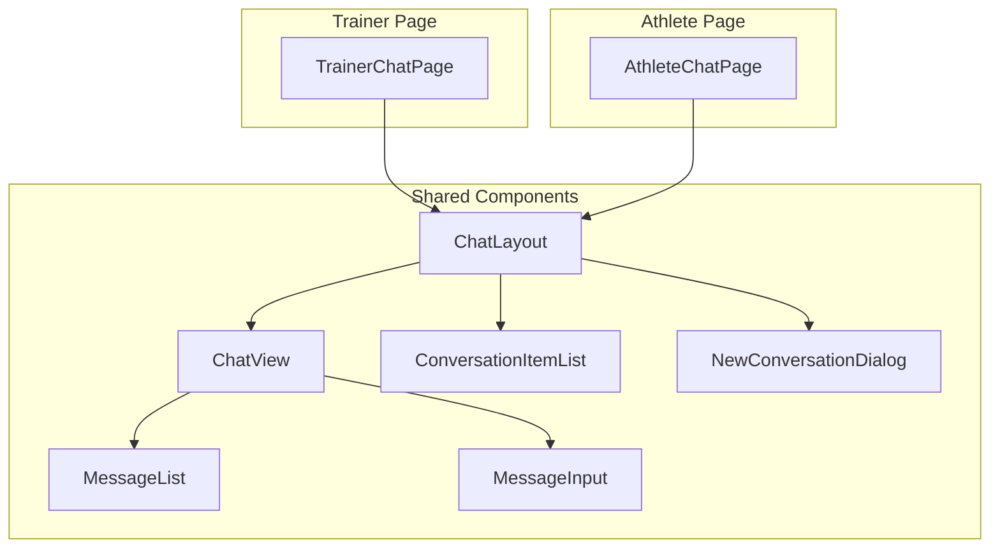
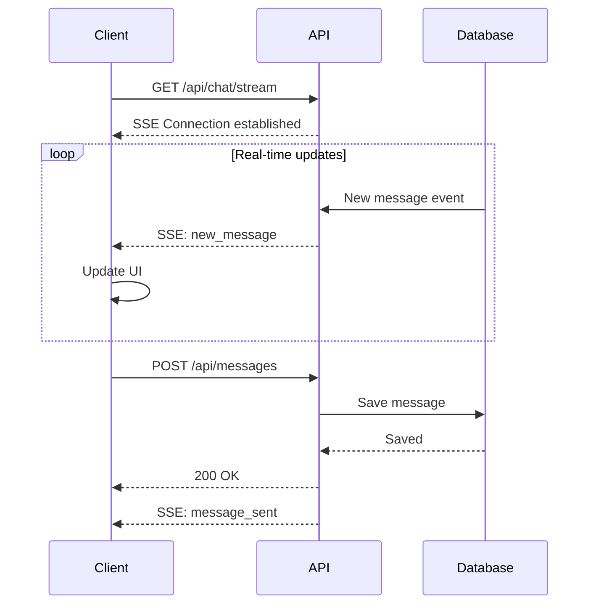
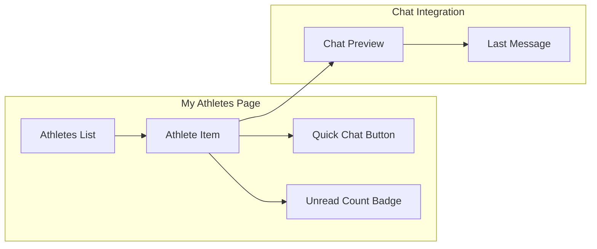
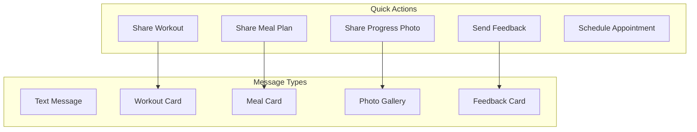

# Plan Przebudowy Systemu Czatu Trener-Sportowiec

## Spis treści
1. [Analiza obecnego stanu](#1-analiza-obecnego-stanu)
2. [Zidentyfikowane problemy](#2-zidentyfikowane-problemy)
3. [Proponowane usprawnienia](#3-proponowane-usprawnienia)
4. [Architektura docelowa](#4-architektura-docelowa)
5. [Plan implementacji](#5-plan-implementacji)
6. [Szczegóły techniczne](#6-szczegóły-techniczne)

---

## 1. Analiza obecnego stanu

### 1.1 Struktura plików

```
src/app/(trainer)/trainer/chat/page.tsx       # Widok czatu trenera (~526 linii)
src/app/(athlete)/athlete/chat/page.tsx       # Widok czatu sportowca (~485 linii)
src/app/(trainer)/trainer/my-athletes/page.tsx # Lista sportowców trenera (~461 linii)
src/app/(trainer)/trainer/my-athletes/[athleteId]/page.tsx # Profil sportowca (~595 linii)
src/models/Conversation.ts                     # Model konwersacji
src/models/Message.ts                          # Model wiadomości
```

### 1.2 Obecna architektura

```mermaid
flowchart TB
    subgraph Trainer Side
        TC[/trainer/chat]
        MA[/trainer/my-athletes]
        MAP[/trainer/my-athletes/athleteId]
    end

    subgraph Athlete Side
        AC[/athlete/chat]
    end

    subgraph Database
        CONV[(conversations)]
        MSG[(messages)]
        USERS[(users)]
    end

    TC --> CONV
    TC --> MSG
    AC --> CONV
    AC --> MSG
    MA --> USERS
    MAP --> USERS
    MAP -.-> TC
```

### 1.3 Model danych konwersacji

```typescript
interface IConversation {
  _id: string;
  conversationId: string;           // Format: sortedUserId1_sortedUserId2
  participants: string[];           // Tablica ID uczestników
  trainerId: string;
  athleteId: string;
  trainerName: string;
  athleteName: string;
  lastMessage: {
    text: string;
    senderId: string;
    createdAt: Date;
  } | null;
  updatedAt: Date;
  unreadCount?: {
    [userId: string]: number;
  };
}

interface IMessage {
  _id: string;
  conversationId: string;
  senderId: string;
  text: string;
  createdAt: Date;
}
```

### 1.4 Obecny przepływ użytkownika

**Trener:**
1. Wchodzi na `/trainer/chat` → widzi listę konwersacji
2. Może utworzyć nową konwersację przez dialog "Nowa Wiadomość"
3. Alternatywnie: `/trainer/my-athletes` → profil sportowca → przycisk "Napisz Wiadomość"

**Sportowiec:**
1. Wchodzi na `/athlete/chat` → widzi listę konwersacji
2. Może utworzyć nową konwersację tylko z przypisanym trenerem

---

## 2. Zidentyfikowane problemy

### 2.1 Duplikacja kodu
- **Problem:** Pliki [`trainer/chat/page.tsx`](src/app/(trainer)/trainer/chat/page.tsx:1) i [`athlete/chat/page.tsx`](src/app/(athlete)/athlete/chat/page.tsx:1) zawierają prawie identyczny kod (~90% podobieństwa)
- **Komponenty zduplikowane:**
  - `NewConversationDialog`
  - `ChatView`
  - Główny komponent `ChatPage`
- **Wpływ:** Trudność w utrzymaniu, ryzyko rozbieżności funkcjonalności

### 2.2 Niespójność w typach danych
- **Problem:** Różne nazwy pól w różnych miejscach
  - Trainer: `participants` vs Athlete: `participantIds`
  - Różne struktury `Conversation` interface w obu plikach
- **Wpływ:** Potencjalne błędy, trudność w debugowaniu

### 2.3 Brak real-time komunikacji
- **Problem:** Polling co 3-5 sekund zamiast WebSocket/SSE
  - Trainer: polling co 3 sekundy
  - Athlete: polling co 5 sekund
- **Wpływ:** Opóźnienia w dostarczaniu wiadomości, zwiększone obciążenie serwera

### 2.4 Brak integracji z listą sportowców
- **Problem:** Strona `/trainer/my-athletes` nie pokazuje statusu konwersacji
- **Wpływ:** Trener musi przełączać się między widokami

### 2.5 Ograniczona funkcjonalność
- **Brakujące funkcje:**
  - Wyszukiwanie w wiadomościach
  - Załączniki (zdjęcia, pliki)
  - Reakcje/emoji
  - Oznaczanie wiadomości jako ważne
  - Historia edycji wiadomości
  - Powiadomienia push
  - Status online/offline użytkowników
  - Wskaźnik pisania (typing indicator)

### 2.6 UX/UI problemy
- **Problem:** Brak wizualnego rozróżnienia między przeczytanymi/nieprzeczytanymi
- **Problem:** Brak grupowania wiadomości po dacie
- **Problem:** Brak podglądu ostatniej aktywności użytkownika

---

## 3. Proponowane usprawnienia

### 3.1 Refaktoryzacja architektury komponentów



### 3.2 Nowa struktura plików

```
src/
├── components/
│   └── chat/
│       ├── ChatLayout.tsx           # Główny layout czatu
│       ├── ChatView.tsx             # Widok pojedynczej konwersacji
│       ├── MessageList.tsx          # Lista wiadomości
│       ├── MessageItem.tsx          # Pojedyncza wiadomość
│       ├── MessageInput.tsx         # Pole wprowadzania wiadomości
│       ├── ConversationList.tsx     # Lista konwersacji
│       ├── ConversationItem.tsx     # Element listy konwersacji
│       ├── NewConversationDialog.tsx # Dialog nowej konwersacji
│       ├── ChatHeader.tsx           # Nagłówek czatu
│       ├── TypingIndicator.tsx      # Wskaźnik pisania
│       ├── OnlineStatus.tsx         # Status online
│       └── hooks/
│           ├── useChat.ts           # Hook zarządzania czatem
│           ├── useMessages.ts       # Hook wiadomości
│           ├── useConversations.ts  # Hook konwersacji
│           └── useTypingIndicator.ts # Hook wskaźnika pisania
├── app/
│   ├── (trainer)/trainer/chat/
│   │   └── page.tsx                 # Uproszczony - używa ChatLayout
│   └── (athlete)/athlete/chat/
│       └── page.tsx                 # Uproszczony - używa ChatLayout
└── lib/
    └── chat/
        ├── types.ts                 # Typy dla czatu
        └── utils.ts                 # Funkcje pomocnicze
```

### 3.3 Nowe funkcjonalności

#### 3.3.1 Real-time komunikacja (Server-Sent Events)



#### 3.3.2 Integracja z listą sportowców



#### 3.3.3 Załączniki i multimedia

```typescript
interface MessageAttachment {
  id: string;
  type: 'image' | 'file' | 'workout' | 'meal';
  url: string;
  name: string;
  size?: number;
  thumbnailUrl?: string;
  metadata?: {
    workoutId?: string;
    mealId?: string;
  };
}

interface IMessageExtended extends IMessage {
  attachments?: MessageAttachment[];
  replyTo?: string;  // ID wiadomości na którą odpowiadamy
  editedAt?: Date;
  reactions?: {
    emoji: string;
    userIds: string[];
  }[];
}
```

#### 3.3.4 Szybkie akcje w czacie



---

## 4. Architektura docelowa

### 4.1 Diagram komponentów

```mermaid
flowchart TB
    subgraph Frontend
        subgraph Pages
            TCP[Trainer Chat Page]
            ACP[Athlete Chat Page]
            MAP[My Athletes Page]
        end

        subgraph Shared Components
            CL[ChatLayout]
            CV[ChatView]
            ML[MessageList]
            MI[MessageInput]
            CIL[ConversationList]
        end

        subgraph Hooks
            UC[useChat]
            UM[useMessages]
            UCO[useConversations]
            USS[useSSE]
        end

        subgraph Context
            CC[ChatContext]
        end
    end

    subgraph Backend
        subgraph API Routes
            AR1[/api/conversations]
            AR2[/api/messages]
            AR3[/api/chat/stream]
            AR4[/api/chat/typing]
        end

        subgraph Services
            CS[ChatService]
            NS[NotificationService]
        end
    end

    subgraph Database
        CONV[(conversations)]
        MSG[(messages)]
    end

    TCP --> CL
    ACP --> CL
    MAP -.-> CIL

    CL --> CV
    CL --> CIL
    CV --> ML
    CV --> MI

    CL --> CC
    CC --> UC
    UC --> UM
    UC --> UCO
    UC --> USS

    USS --> AR3
    UM --> AR2
    UCO --> AR1

    AR1 --> CS
    AR2 --> CS
    AR3 --> CS
    CS --> CONV
    CS --> MSG
    CS --> NS
```

### 4.2 Model danych - rozszerzony

```typescript
// Rozszerzony model konwersacji
interface IConversationExtended {
  _id: string;
  participantIds: string[];
  participants: {
    id: string;
    name: string;
    role: 'trainer' | 'athlete';
    avatarUrl?: string;
    lastSeen?: Date;
  }[];
  type: 'direct' | 'group';  // Przygotowanie na przyszłe grupy
  lastMessage: {
    text: string;
    senderId: string;
    createdAt: Date;
    type: 'text' | 'attachment' | 'system';
  } | null;
  unreadCount: Map<string, number>;
  pinnedBy: string[];  // Użytkownicy którzy przypięli konwersację
  mutedBy: string[];   // Użytkownicy którzy wyciszyli
  metadata: {
    createdBy: string;
    createdAt: Date;
  };
  updatedAt: Date;
}

// Rozszerzony model wiadomości
interface IMessageExtended {
  _id: string;
  conversationId: string;
  senderId: string;
  text: string;
  type: 'text' | 'attachment' | 'system' | 'workout' | 'meal';
  attachments?: {
    id: string;
    type: string;
    url: string;
    name: string;
    size?: number;
    thumbnailUrl?: string;
  }[];
  replyTo?: {
    messageId: string;
    text: string;
    senderId: string;
  };
  reactions?: {
    emoji: string;
    userIds: string[];
  }[];
  readBy: {
    userId: string;
    readAt: Date;
  }[];
  editHistory?: {
    text: string;
    editedAt: Date;
  }[];
  deletedAt?: Date;
  createdAt: Date;
  updatedAt: Date;
}
```

### 4.3 API Endpoints

| Endpoint | Metoda | Opis |
|----------|--------|------|
| `/api/conversations` | GET | Lista konwersacji użytkownika |
| `/api/conversations` | POST | Utwórz nową konwersację |
| `/api/conversations/[id]` | GET | Szczegóły konwersacji |
| `/api/conversations/[id]` | PATCH | Aktualizuj konwersację (pin, mute) |
| `/api/conversations/[id]` | DELETE | Usuń konwersację |
| `/api/conversations/[id]/messages` | GET | Wiadomości w konwersacji (paginacja) |
| `/api/conversations/[id]/messages` | POST | Wyślij wiadomość |
| `/api/messages/[id]` | PATCH | Edytuj wiadomość |
| `/api/messages/[id]` | DELETE | Usuń wiadomość |
| `/api/messages/[id]/reactions` | POST | Dodaj reakcję |
| `/api/chat/stream` | GET | SSE stream dla real-time |
| `/api/chat/typing` | POST | Wskaźnik pisania |
| `/api/chat/read` | POST | Oznacz jako przeczytane |

---

## 5. Plan implementacji

### Faza 1: Refaktoryzacja i ujednolicenie (Priorytet: Wysoki)

#### 5.1.1 Utworzenie współdzielonych komponentów
- [ ] Utworzyć katalog `src/components/chat/`
- [ ] Wyekstrahować `ChatLayout` z istniejącego kodu
- [ ] Wyekstrahować `ChatView` jako reużywalny komponent
- [ ] Wyekstrahować `MessageList` i `MessageItem`
- [ ] Wyekstrahować `MessageInput`
- [ ] Wyekstrahować `ConversationList` i `ConversationItem`
- [ ] Wyekstrahować `NewConversationDialog`

#### 5.1.2 Ujednolicenie typów
- [ ] Utworzyć `src/lib/chat/types.ts` z ujednoliconymi interfejsami
- [ ] Zaktualizować model `Conversation` w bazie danych
- [ ] Migracja istniejących danych (jeśli potrzebna)

#### 5.1.3 Utworzenie hooków
- [ ] `useChat` - główny hook zarządzania stanem czatu
- [ ] `useMessages` - pobieranie i wysyłanie wiadomości
- [ ] `useConversations` - zarządzanie listą konwersacji

#### 5.1.4 Uproszczenie stron
- [ ] Przepisać `/trainer/chat/page.tsx` używając nowych komponentów
- [ ] Przepisać `/athlete/chat/page.tsx` używając nowych komponentów

### Faza 2: Integracja z My Athletes (Priorytet: Wysoki)

#### 5.2.1 Rozszerzenie strony My Athletes
- [ ] Dodać podgląd ostatniej wiadomości przy każdym sportowcu
- [ ] Dodać badge z liczbą nieprzeczytanych wiadomości
- [ ] Dodać przycisk szybkiego czatu
- [ ] Dodać status online/offline

#### 5.2.2 Quick Chat Widget
- [ ] Utworzyć mini-widget czatu do osadzenia na stronie profilu sportowca
- [ ] Umożliwić szybkie wysłanie wiadomości bez opuszczania strony

### Faza 3: Real-time komunikacja (Priorytet: Średni)

#### 5.3.1 Server-Sent Events
- [ ] Utworzyć endpoint `/api/chat/stream`
- [ ] Zaimplementować hook `useSSE`
- [ ] Zintegrować SSE z komponentami czatu
- [ ] Dodać fallback na polling dla starszych przeglądarek

#### 5.3.2 Typing Indicator
- [ ] Utworzyć endpoint `/api/chat/typing`
- [ ] Zaimplementować komponent `TypingIndicator`
- [ ] Zintegrować z `MessageInput`

#### 5.3.3 Online Status
- [ ] Dodać pole `lastSeen` do modelu użytkownika
- [ ] Utworzyć komponent `OnlineStatus`
- [ ] Aktualizować status przy aktywności użytkownika

### Faza 4: Rozszerzone funkcjonalności (Priorytet: Niski)

#### 5.4.1 Załączniki
- [ ] Rozszerzyć model `Message` o pole `attachments`
- [ ] Utworzyć komponent `AttachmentUploader`
- [ ] Utworzyć komponent `AttachmentPreview`
- [ ] Zintegrować z Cloudinary/S3 dla przechowywania plików

#### 5.4.2 Reakcje
- [ ] Dodać pole `reactions` do modelu `Message`
- [ ] Utworzyć komponent `ReactionPicker`
- [ ] Utworzyć komponent `ReactionDisplay`

#### 5.4.3 Odpowiedzi na wiadomości
- [ ] Dodać pole `replyTo` do modelu `Message`
- [ ] Utworzyć komponent `ReplyPreview`
- [ ] Zmodyfikować `MessageInput` dla trybu odpowiedzi

#### 5.4.4 Wyszukiwanie
- [ ] Utworzyć endpoint `/api/conversations/[id]/search`
- [ ] Utworzyć komponent `MessageSearch`
- [ ] Dodać indeks tekstowy w MongoDB

#### 5.4.5 Udostępnianie treningów i posiłków
- [ ] Utworzyć komponent `ShareWorkoutCard`
- [ ] Utworzyć komponent `ShareMealCard`
- [ ] Zintegrować z systemem treningów i diet

---

## 6. Szczegóły techniczne

### 6.1 Przykład implementacji ChatLayout

```typescript
// src/components/chat/ChatLayout.tsx
interface ChatLayoutProps {
  userRole: 'trainer' | 'athlete';
  userId: string;
}

export function ChatLayout({ userRole, userId }: ChatLayoutProps) {
  const [selectedConversationId, setSelectedConversationId] = useState<string | null>(null);
  const { conversations, isLoading } = useConversations(userId);
  const { messages, sendMessage } = useMessages(selectedConversationId);

  return (
    <div className="grid grid-cols-1 md:grid-cols-3 xl:grid-cols-4 h-full">
      <aside className="border-r">
        <ChatHeader userRole={userRole} />
        <ConversationList
          conversations={conversations}
          selectedId={selectedConversationId}
          onSelect={setSelectedConversationId}
          isLoading={isLoading}
        />
      </aside>
      <main className="md:col-span-2 xl:col-span-3">
        {selectedConversationId ? (
          <ChatView
            conversationId={selectedConversationId}
            messages={messages}
            onSendMessage={sendMessage}
            currentUserId={userId}
          />
        ) : (
          <EmptyState />
        )}
      </main>
    </div>
  );
}
```

### 6.2 Przykład implementacji useChat hook

```typescript
// src/components/chat/hooks/useChat.ts
export function useChat(userId: string) {
  const [selectedConversationId, setSelectedConversationId] = useState<string | null>(null);

  const {
    conversations,
    isLoading: conversationsLoading,
    refetch: refetchConversations
  } = useConversations(userId);

  const {
    messages,
    isLoading: messagesLoading,
    sendMessage,
    refetch: refetchMessages
  } = useMessages(selectedConversationId);

  // SSE for real-time updates
  useSSE('/api/chat/stream', {
    onMessage: (event) => {
      if (event.type === 'new_message') {
        refetchMessages();
        refetchConversations();
      }
    }
  });

  return {
    conversations,
    messages,
    selectedConversationId,
    setSelectedConversationId,
    sendMessage,
    isLoading: conversationsLoading || messagesLoading,
  };
}
```

### 6.3 Przykład SSE endpoint

```typescript
// src/app/api/chat/stream/route.ts
export async function GET(req: Request) {
  const userId = await getCurrentUserId(req);

  const stream = new ReadableStream({
    start(controller) {
      const encoder = new TextEncoder();

      // Subscribe to message events for this user
      const unsubscribe = subscribeToUserMessages(userId, (message) => {
        const data = `data: ${JSON.stringify(message)}\n\n`;
        controller.enqueue(encoder.encode(data));
      });

      // Cleanup on close
      req.signal.addEventListener('abort', () => {
        unsubscribe();
        controller.close();
      });
    }
  });

  return new Response(stream, {
    headers: {
      'Content-Type': 'text/event-stream',
      'Cache-Control': 'no-cache',
      'Connection': 'keep-alive',
    },
  });
}
```

### 6.4 Migracja danych

```javascript
// scripts/migrate-conversations.js
async function migrateConversations() {
  const db = await getMongoDb();

  // Ujednolicenie pola participants/participantIds
  await db.collection('conversations').updateMany(
    { participantIds: { $exists: true } },
    [
      {
        $set: {
          participants: '$participantIds'
        }
      },
      {
        $unset: 'participantIds'
      }
    ]
  );

  // Dodanie brakujących pól
  await db.collection('conversations').updateMany(
    { pinnedBy: { $exists: false } },
    {
      $set: {
        pinnedBy: [],
        mutedBy: [],
        type: 'direct'
      }
    }
  );
}
```

---

## Podsumowanie

### Korzyści z przebudowy:

1. **Redukcja duplikacji kodu** - z ~1000 linii do ~300 linii w stronach
2. **Łatwiejsze utrzymanie** - jeden zestaw komponentów dla obu ról
3. **Lepsza wydajność** - real-time zamiast polling
4. **Rozszerzona funkcjonalność** - załączniki, reakcje, wyszukiwanie
5. **Lepsza integracja** - czat dostępny z poziomu listy sportowców
6. **Skalowalność** - przygotowanie na przyszłe funkcje (grupy, powiadomienia push)

### Szacowany czas implementacji:

| Faza | Czas | Priorytet |
|------|------|-----------|
| Faza 1: Refaktoryzacja | 3-4 dni | Wysoki |
| Faza 2: Integracja My Athletes | 2 dni | Wysoki |
| Faza 3: Real-time | 2-3 dni | Średni |
| Faza 4: Rozszerzone funkcje | 4-5 dni | Niski |
| **Razem** | **11-14 dni** | - |

### Ryzyka:

1. **Migracja danych** - wymaga starannego testowania
2. **Kompatybilność wsteczna** - stare konwersacje muszą działać
3. **Wydajność SSE** - wymaga monitorowania przy dużej liczbie użytkowników