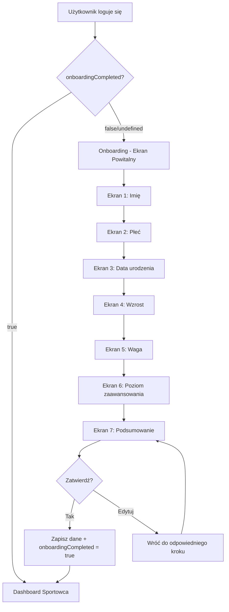

# Plan Implementacji Onboardingu Sportowca

## 📋 Przegląd

Celem jest stworzenie wieloekranowego procesu onboardingu dla nowych sportowców po pierwszym zalogowaniu. Onboarding będzie zbierać podstawowe dane o użytkowniku poprzez atrakcyjne wizualnie ekrany z animacjami i grafikami związanymi z siłownią.

---

## 🎯 Dane do zebrania

| Pole | Typ | Walidacja | Ekran |
|------|-----|-----------|-------|
| Imię | `string` | wymagane, min 2 znaki | 1 |
| Płeć | `enum: 'male' \| 'female' \| 'other'` | wymagane | 2 |
| Data urodzenia | `Date` | wymagane, wiek 13-100 lat | 3 |
| Wzrost | `number` (cm) | wymagane, 100-250 cm | 4 |
| Waga | `number` (kg) | wymagane, 30-300 kg | 5 |
| Poziom zaawansowania | `TrainingLevel` (beginner/intermediate/advanced) | wymagane | 6 |

---

## 🏗️ Architektura Rozwiązania

### 1. Rozszerzenie Modelu Użytkownika

**Plik:** [`src/models/User.ts`](src/models/User.ts)

Dodać nowe pola do interfejsu `IUser`:

```typescript
export interface IUser extends Document {
  // ... istniejące pola

  // Onboarding fields
  onboardingCompleted?: boolean;
  gender?: 'male' | 'female' | 'other';
  dateOfBirth?: Date;
  height?: number; // w cm
  weight?: number; // w kg
  trainingLevel?: 'beginner' | 'intermediate' | 'advanced';
}
```

### 2. Rozszerzenie Typów

**Plik:** [`src/models/types/user.ts`](src/models/types/user.ts)

```typescript
export interface UserProfile {
  // ... istniejące pola

  onboardingCompleted?: boolean;
  gender?: 'male' | 'female' | 'other';
  dateOfBirth?: string;
  height?: number;
  weight?: number;
  trainingLevel?: 'beginner' | 'intermediate' | 'advanced';
}

// Nowy typ dla onboardingu
export interface OnboardingData {
  name: string;
  gender: 'male' | 'female' | 'other';
  dateOfBirth: string;
  height: number;
  weight: number;
  trainingLevel: 'beginner' | 'intermediate' | 'advanced';
}
```

---

## 📱 Struktura Ekranów Onboardingu

### Ekran 0: Powitanie
- Animowane logo/grafika siłowni
- Tekst powitalny: "Witaj w GymProgress!"
- Krótki opis: "Odpowiedz na kilka pytań, aby spersonalizować Twoje doświadczenie"
- Przycisk "Rozpocznij"

### Ekran 1: Imię
- Animacja: postać z hantlami witająca użytkownika
- Nagłówek: "Jak masz na imię?"
- Input tekstowy z walidacją
- Progress bar: 1/6

### Ekran 2: Płeć
- Animacja: sylwetki sportowców
- Nagłówek: "Wybierz swoją płeć"
- Trzy duże karty do wyboru:
  - 🚹 Mężczyzna
  - 🚺 Kobieta
  - ⚧ Inna
- Progress bar: 2/6

### Ekran 3: Data urodzenia
- Animacja: kalendarz z ciężarkami
- Nagłówek: "Kiedy się urodziłeś?"
- Date picker (rok, miesiąc, dzień)
- Obliczanie i wyświetlanie wieku w czasie rzeczywistym
- Progress bar: 3/6

### Ekran 4: Wzrost
- Animacja: miarka/linijka przy postaci
- Nagłówek: "Jaki jest Twój wzrost?"
- Slider interaktywny (100-250 cm)
- Wizualizacja wzrostu przy postaci
- Progress bar: 4/6

### Ekran 5: Waga
- Animacja: waga z obciążnikami
- Nagłówek: "Ile ważysz?"
- Input numeryczny z suwakiem
- Informacja o BMI (opcjonalnie)
- Progress bar: 5/6

### Ekran 6: Poziom zaawansowania
- Animacja: progresja od początkującego do zaawansowanego
- Nagłówek: "Jaki jest Twój poziom zaawansowania?"
- Trzy karty z opisami:
  - 🌱 **Początkujący** - "Dopiero zaczynam swoją przygodę z siłownią"
  - 💪 **Średniozaawansowany** - "Regularnie ćwiczę od kilku miesięcy"
  - 🏆 **Zaawansowany** - "Trenuję od lat, znam technikę ćwiczeń"
- Progress bar: 6/6

### Ekran 7: Podsumowanie
- Animacja: confetti/sukces
- Nagłówek: "Wszystko gotowe!"
- Podsumowanie wprowadzonych danych
- Przycisk "Rozpocznij trening"
- Możliwość edycji przed zatwierdzeniem

---

## 📁 Struktura Plików

```
src/
├── app/
│   └── (athlete)/
│       └── athlete/
│           └── onboarding/
│               ├── page.tsx              # Główny komponent onboardingu
│               └── layout.tsx            # Layout bez nawigacji
├── components/
│   └── onboarding/
│       ├── OnboardingWizard.tsx          # Główny wizard
│       ├── OnboardingProgress.tsx        # Pasek postępu
│       ├── steps/
│       │   ├── WelcomeStep.tsx           # Ekran powitalny
│       │   ├── NameStep.tsx              # Krok z imieniem
│       │   ├── GenderStep.tsx            # Krok z płcią
│       │   ├── BirthDateStep.tsx         # Krok z datą urodzenia
│       │   ├── HeightStep.tsx            # Krok ze wzrostem
│       │   ├── WeightStep.tsx            # Krok z wagą
│       │   ├── TrainingLevelStep.tsx     # Krok z poziomem
│       │   └── SummaryStep.tsx           # Podsumowanie
│       ├── animations/
│       │   ├── WelcomeAnimation.tsx      # Animacja powitalna
│       │   ├── GenderAnimation.tsx       # Animacja wyboru płci
│       │   ├── HeightAnimation.tsx       # Animacja wzrostu
│       │   ├── WeightAnimation.tsx       # Animacja wagi
│       │   └── SuccessAnimation.tsx      # Animacja sukcesu
│       └── ui/
│           ├── OnboardingCard.tsx        # Karta wyboru
│           ├── HeightSlider.tsx          # Slider wzrostu
│           └── WeightInput.tsx           # Input wagi
├── hooks/
│   └── useOnboarding.ts                  # Hook zarządzający stanem onboardingu
└── lib/
    └── onboarding-utils.ts               # Funkcje pomocnicze
```

---

## 🔄 Flow Aplikacji



---

## 🎨 Design System

### Kolory
- **Primary:** Niebieski gradient (#3B82F6 → #1D4ED8)
- **Success:** Zielony (#10B981)
- **Background:** Ciemny z subtelnymi gradientami
- **Cards:** Glassmorphism effect z blur

### Animacje
- **Framer Motion** do płynnych przejść między ekranami
- Slide transitions (nowy ekran wjeżdża z prawej)
- Subtle bounce effects na interaktywnych elementach
- Lottie animations dla grafik związanych z siłownią

### Responsywność
- Mobile-first design
- Pełnoekranowe karty na mobile
- Centered layout z max-width na desktop

---

## 🔧 Implementacja Techniczna

### 1. Modyfikacja Layout Athlete

**Plik:** [`src/app/(athlete)/layout.tsx`](src/app/(athlete)/layout.tsx)

Dodać sprawdzenie `onboardingCompleted` i przekierowanie:

```typescript
useEffect(() => {
  if (!isLoading && user && userProfile) {
    if (userProfile.role === 'athlete' && !userProfile.onboardingCompleted) {
      router.push('/athlete/onboarding');
    }
  }
}, [user, userProfile, isLoading, router]);
```

### 2. API Endpoint

**Plik:** `src/app/api/onboarding/complete/route.ts`

```typescript
// POST /api/onboarding/complete
// Body: OnboardingData
// Response: { success: boolean, user: UserProfile }
```

### 3. Hook useOnboarding

```typescript
interface UseOnboardingReturn {
  currentStep: number;
  totalSteps: number;
  data: Partial<OnboardingData>;
  setStepData: (step: string, value: any) => void;
  nextStep: () => void;
  prevStep: () => void;
  goToStep: (step: number) => void;
  isFirstStep: boolean;
  isLastStep: boolean;
  submitOnboarding: () => Promise<void>;
  isSubmitting: boolean;
}
```

---

## ✅ TODO Lista Implementacji

### Faza 1: Przygotowanie
- [ ] Rozszerzyć model User.ts o nowe pola onboardingu
- [ ] Zaktualizować typy w types/user.ts
- [ ] Utworzyć schemat walidacji Zod dla OnboardingData

### Faza 2: Struktura
- [ ] Utworzyć folder src/app/(athlete)/athlete/onboarding/
- [ ] Utworzyć layout.tsx dla onboardingu (bez nawigacji)
- [ ] Utworzyć page.tsx z głównym komponentem
- [ ] Utworzyć folder src/components/onboarding/

### Faza 3: Komponenty UI
- [ ] OnboardingWizard - główny komponent zarządzający krokami
- [ ] OnboardingProgress - pasek postępu
- [ ] OnboardingCard - reużywalna karta wyboru

### Faza 4: Kroki Onboardingu
- [ ] WelcomeStep - ekran powitalny
- [ ] NameStep - krok z imieniem
- [ ] GenderStep - krok z płcią
- [ ] BirthDateStep - krok z datą urodzenia
- [ ] HeightStep - krok ze wzrostem
- [ ] WeightStep - krok z wagą
- [ ] TrainingLevelStep - krok z poziomem zaawansowania
- [ ] SummaryStep - podsumowanie

### Faza 5: Animacje i Grafiki
- [ ] Dodać Framer Motion do projektu (jeśli brak)
- [ ] Zaimplementować animacje przejść między krokami
- [ ] Utworzyć lub zintegrować grafiki/ikony siłowni
- [ ] Dodać animacje Lottie (opcjonalnie)

### Faza 6: Logika i API
- [ ] Utworzyć hook useOnboarding
- [ ] Utworzyć endpoint API /api/onboarding/complete
- [ ] Zaimplementować walidację danych
- [ ] Dodać obsługę błędów

### Faza 7: Integracja
- [ ] Zmodyfikować layout.tsx aby sprawdzał onboardingCompleted
- [ ] Dodać przekierowanie do onboardingu dla nowych użytkowników
- [ ] Przetestować cały flow

### Faza 8: Polish
- [ ] Responsywność na wszystkich urządzeniach
- [ ] Dostępność (a11y)
- [ ] Testy jednostkowe i E2E
- [ ] Optymalizacja wydajności

---

## 📦 Wymagane Biblioteki

```json
{
  "dependencies": {
    "framer-motion": "^10.x",
    "date-fns": "już zainstalowane",
    "zod": "do walidacji",
    "@lottiefiles/react-lottie-player": "opcjonalnie dla animacji"
  }
}
```

---

## 🎯 Kryteria Akceptacji

1. ✅ Nowi użytkownicy są automatycznie przekierowywani do onboardingu po pierwszym zalogowaniu
2. ✅ Onboarding składa się z 7 ekranów (powitanie + 6 kroków danych + podsumowanie)
3. ✅ Każdy ekran ma animacje i grafiki związane z siłownią
4. ✅ Użytkownik może nawigować między krokami (wstecz/dalej)
5. ✅ Dane są walidowane przed przejściem do następnego kroku
6. ✅ Podsumowanie pokazuje wszystkie dane przed zatwierdzeniem
7. ✅ Po zatwierdzeniu dane są zapisywane i użytkownik trafia na dashboard
8. ✅ Onboarding jest responsywny i działa na mobile/desktop
9. ✅ Flaga `onboardingCompleted` zapobiega ponownemu wyświetlaniu onboardingu

---

## 🔗 Powiązane Pliki w Projekcie

- [`src/models/User.ts`](src/models/User.ts) - Model użytkownika do rozszerzenia
- [`src/models/types/user.ts`](src/models/types/user.ts) - Typy użytkownika
- [`src/models/types/enums.ts`](src/models/types/enums.ts) - Enum TrainingLevel
- [`src/app/(athlete)/layout.tsx`](src/app/(athlete)/layout.tsx) - Layout do modyfikacji
- [`src/app/register/page.tsx`](src/app/register/page.tsx) - Strona rejestracji
- [`src/app/login/page.tsx`](src/app/login/page.tsx) - Strona logowania

---

## 📝 Notatki Dodatkowe

1. **Istniejący enum TrainingLevel** w [`src/models/types/enums.ts`](src/models/types/enums.ts:25) już definiuje poziomy: `beginner`, `intermediate`, `advanced` - wykorzystać go w onboardingu

2. **Waga użytkownika** jest również zbierana w BodyMeasurement, można rozważyć synchronizację lub osobne traktowanie (waga w profilu vs pomiary ciała)

3. **Imię** już istnieje w modelu User jako `name`, ale warto pozwolić użytkownikowi je zweryfikować/zaktualizować podczas onboardingu

4. **Przyszłe rozszerzenia:**
   - Cele treningowe
   - Preferowane dni treningowe
   - Typ treningu (siła/masa/redukcja)
   - Dostęp do siłowni czy trening domowy