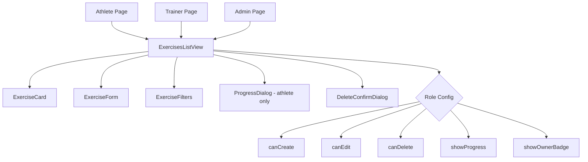

# Refactoring Plan: Types Consolidation & Code Deduplication

## Overview

This document outlines the plan to:
1. Consolidate all TypeScript interfaces/types into `src/models/`
2. Extract duplicated code from athlete/trainer/admin exercises pages into a shared component

## Phase 1: Types Consolidation

### 1.1 Create Types Directory Structure

Create the following structure in `src/models/`:

```
src/models/
├── types/
│   ├── index.ts          # Main export file for all types
│   ├── enums.ts          # All enums
│   ├── user.ts           # User-related types
│   ├── workout.ts        # Workout-related types
│   ├── exercise.ts       # Exercise-related types
│   ├── nutrition.ts      # Meal, Diet, Nutrition types
│   ├── social.ts         # Social profile, posts types
│   └── common.ts         # Shared utility types
├── index.ts              # Updated to export types + models
└── [existing model files]
```

### 1.2 Types to Move from src/lib/types.ts

#### Enums (→ src/models/types/enums.ts)
- `MuscleGroupName`
- `TrainingLevel`
- `SetType`

#### User Types (→ src/models/types/user.ts)
- `UserProfile`
- `AthleteProfile`

#### Workout Types (→ src/models/types/workout.ts)
- `MuscleGroup`
- `Exercise`
- `WorkoutSet`
- `ExerciseSeries`
- `Workout`
- `DayPlan`
- `TrainingWeek`
- `TrainingStage`
- `TrainingPlan`
- `WorkoutExerciseLog`
- `WorkoutLog`
- `PersonalRecord`
- `WorkoutPlan`
- `WorkoutDay`
- `WorkoutDayExercise`
- `PlannedWorkout`
- `AiWorkoutPlan`

#### Nutrition Types (→ src/models/types/nutrition.ts)
- `FoodItem`
- `MealType`
- `Meal`
- `LoggedMeal`
- `DietPlan`

#### Social Types (→ src/models/types/social.ts)
- `SocialProfile`
- `SocialPost`
- `PublicProfileData`

#### Common Types (→ src/models/types/common.ts)
- `Article`
- `ArticleCategory`
- `Goal`
- `Achievement`
- `RunningSession`
- `TrainerRequest`
- `BodyMeasurement`
- `Gym`
- `Conversation`
- `Message`

### 1.3 File Contents

#### src/models/types/enums.ts
```typescript
export enum MuscleGroupName {
  Back = 'Plecy',
  Biceps = 'Biceps',
  Calves = 'Łydki',
  Chest = 'Klata',
  Core = 'Core',
  Forearms = 'Przedramiona',
  FullBody = 'Full Body',
  Glutes = 'Pośladki',
  Hamstrings = 'Dwugłowe uda',
  LowerBack = 'Lower Back',
  Quads = 'Quads',
  RearDelts = 'Rear Delts',
  Shoulders = 'Shoulders',
  AnteriorTibialis = 'Anterior Tibialis',
  Traps = 'Traps',
  Triceps = 'Triceps',
  Adductors = 'Adductors',
  Hips = 'Hips',
  Abductors = 'Abductors'
}

export enum TrainingLevel {
  Beginner = 'beginner',
  Intermediate = 'intermediate',
  Advanced = 'advanced'
}

export enum SetType {
  BackOffSet = 'Back-off set',
  WorkingSet = 'Working set',
  WarmUpSet = 'Warm-up set',
  DropSet = 'Drop set',
  FailureSet = 'Failure set'
}
```

#### src/models/types/index.ts
```typescript
// Re-export all types
export * from './enums';
export * from './user';
export * from './workout';
export * from './exercise';
export * from './nutrition';
export * from './social';
export * from './common';
```

#### src/models/index.ts (Updated)
```typescript
// Export all Mongoose models
export * from './User';
export * from './Article';
export * from './ArticleCategory';
export * from './Exercise';
export * from './WorkoutLog';
export * from './WorkoutPlan';
export * from './Conversation';
export * from './Message';
export * from './BodyMeasurement';
export * from './RunningSession';
export * from './Goal';
export * from './MuscleGroup';
export * from './Gym';
export * from './Meal';
export * from './NutritionGoal';
export * from './PlannedWorkout';
export * from './TrainerRequest';
export * from './Achievement';
export * from './Workout';
export * from './PersonalRecord';
export * from './SocialProfile';
export * from './SocialPost';
export * from './CustomProduct';
export * from './DietPlan';
export * from './SavedMeal';

// Export all TypeScript types
export * from './types';
```

### 1.4 Update src/lib/types.ts (Backward Compatibility)

```typescript
// DEPRECATED: This file is kept for backward compatibility
// Please import from '@/models' instead

export * from '@/models/types';

// Add deprecation warning in development
if (process.env.NODE_ENV === 'development') {
  console.warn(
    'Warning: Importing from @/lib/types is deprecated. ' +
    'Please import from @/models instead.'
  );
}
```

### 1.5 Files to Update (Import Changes)

Search for `from '@/lib/types'` and update to `from '@/models'`:

1. `src/app/(athlete)/athlete/exercises/page.tsx`
2. `src/app/(admin)/admin/exercises/page.tsx`
3. `src/components/shared/WorkoutPlansListView.tsx`
4. `src/app/(athlete)/athlete/workout-plans/page.tsx`
5. `src/lib/set-type-config.ts`
6. `src/models/Workout.ts`
7. And ~40+ other files

---

## Phase 2: Shared ExercisesListView Component

### 2.1 Component Architecture



### 2.2 Props Interface

```typescript
export type ExercisesRole = 'athlete' | 'trainer' | 'admin';

export interface ExercisesListViewProps {
  /** Role determines permissions and display options */
  role: ExercisesRole;

  /** Whether user can create new exercises */
  canCreate?: boolean;

  /** Whether user can edit exercises */
  canEdit?: boolean;

  /** Whether user can delete exercises */
  canDelete?: boolean;

  /** Show progress charts (athlete feature) */
  showProgress?: boolean;

  /** Show owner badges (admin feature) */
  showOwnerBadge?: boolean;

  /** Custom title */
  title?: string;

  /** Custom empty state message */
  emptyMessage?: string;
}
```

### 2.3 Default Configurations by Role

```typescript
const roleDefaults: Record<ExercisesRole, Partial<ExercisesListViewProps>> = {
  athlete: {
    canCreate: false,
    canEdit: true,  // Only own exercises
    canDelete: true, // Only own exercises
    showProgress: true,
    showOwnerBadge: false,
  },
  trainer: {
    canCreate: true,
    canEdit: true,
    canDelete: true,
    showProgress: false,
    showOwnerBadge: false,
  },
  admin: {
    canCreate: true,
    canEdit: true,
    canDelete: true,
    showProgress: false,
    showOwnerBadge: true,
  },
};
```

### 2.4 Shared Sub-components

#### ExerciseCard
- Display exercise image/placeholder
- Show name, muscle groups, type badges
- Action buttons based on permissions
- Progress button for athletes

#### ExerciseForm
- Unified form for create/edit
- React Hook Form + Zod validation
- Image upload (UploadThing)
- AI image generation
- URL input option

#### ExerciseFilters
- Search input
- Muscle group filter
- Exercise type filter

#### ProgressDialog
- Chart showing exercise progress over time
- Only shown for athletes

### 2.5 File Structure

```
src/components/shared/
├── exercises/
│   ├── index.ts
│   ├── ExercisesListView.tsx
│   ├── ExerciseCard.tsx
│   ├── ExerciseForm.tsx
│   ├── ExerciseFilters.tsx
│   ├── ProgressDialog.tsx
│   └── types.ts
└── index.ts (updated)
```

### 2.6 Updated Page Files

#### src/app/(athlete)/athlete/exercises/page.tsx
```typescript
import { ExercisesListView } from '@/components/shared/exercises';

export default function AthleteExercisesPage() {
  return <ExercisesListView role="athlete" />;
}
```

#### src/app/(trainer)/trainer/exercises/page.tsx
```typescript
import { ExercisesListView } from '@/components/shared/exercises';

export default function TrainerExercisesPage() {
  return <ExercisesListView role="trainer" />;
}
```

#### src/app/(admin)/admin/exercises/page.tsx
```typescript
import { ExercisesListView } from '@/components/shared/exercises';

export default function AdminExercisesPage() {
  return <ExercisesListView role="admin" />;
}
```

---

## Implementation Order

1. **Create types directory structure** in `src/models/types/`
2. **Move enums** to `src/models/types/enums.ts`
3. **Move types** to respective files (user, workout, nutrition, social, common)
4. **Create types index** `src/models/types/index.ts`
5. **Update models index** `src/models/index.ts`
6. **Update src/lib/types.ts** to re-export from models
7. **Test** that existing imports still work
8. **Create ExercisesListView** component structure
9. **Extract shared logic** from existing pages
10. **Update exercise pages** to use shared component
11. **Test** all three exercise pages work correctly
12. **Gradually update imports** from `@/lib/types` to `@/models`

---

## Estimated Impact

### Files to Create
- `src/models/types/index.ts`
- `src/models/types/enums.ts`
- `src/models/types/user.ts`
- `src/models/types/workout.ts`
- `src/models/types/exercise.ts`
- `src/models/types/nutrition.ts`
- `src/models/types/social.ts`
- `src/models/types/common.ts`
- `src/components/shared/exercises/index.ts`
- `src/components/shared/exercises/ExercisesListView.tsx`
- `src/components/shared/exercises/ExerciseCard.tsx`
- `src/components/shared/exercises/ExerciseForm.tsx`
- `src/components/shared/exercises/ExerciseFilters.tsx`
- `src/components/shared/exercises/ProgressDialog.tsx`
- `src/components/shared/exercises/types.ts`

### Files to Modify
- `src/models/index.ts`
- `src/lib/types.ts`
- `src/components/shared/index.ts`
- `src/app/(athlete)/athlete/exercises/page.tsx`
- `src/app/(trainer)/trainer/exercises/page.tsx`
- `src/app/(admin)/admin/exercises/page.tsx`

### Code Reduction
- Current exercises pages: ~1,648 lines total
- After refactoring: ~30 lines total (3 pages × 10 lines)
- Shared component: ~800 lines
- **Net reduction: ~800+ lines of duplicated code**