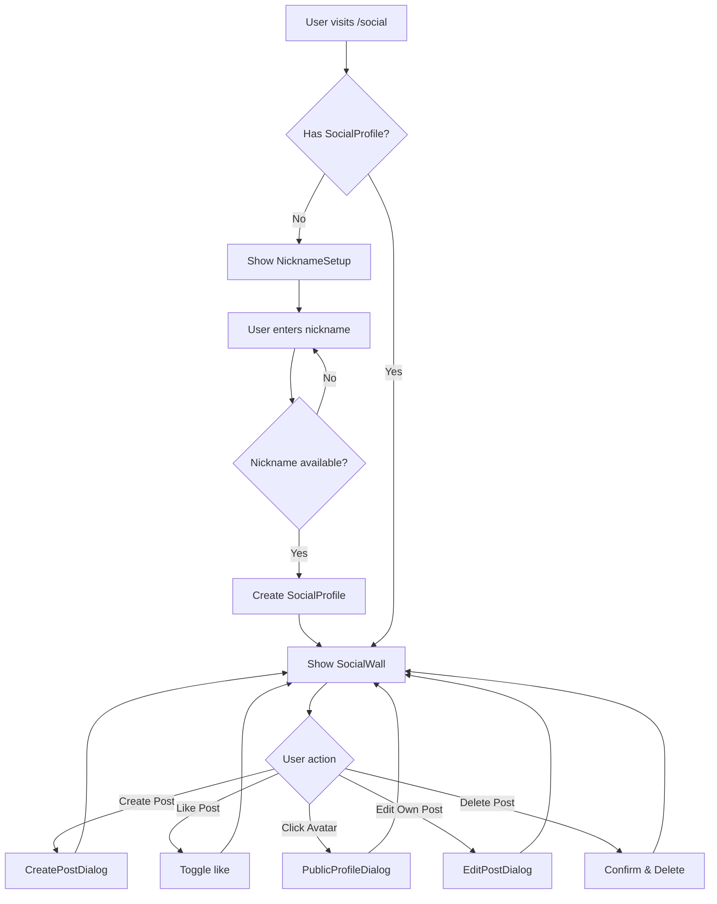
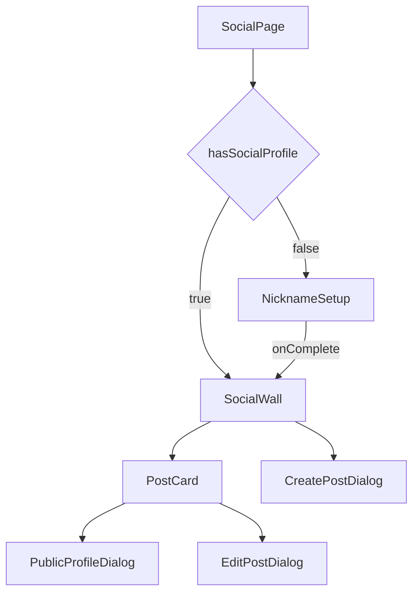
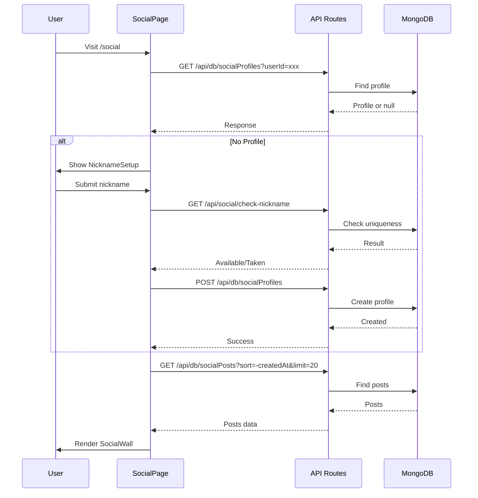

# Social Wall Feature - Implementation Plan

## Overview

This document outlines the implementation plan for a new social wall feature accessible at `/athlete/social` and `/trainer/social`. The feature allows users to share photos with descriptions in an Instagram-like feed with a masonry grid layout.

## Requirements Summary

1. **First-time Setup**: Users must choose a unique nickname before accessing the social wall
2. **Main Feed**: Single wall with pagination displaying posts in a masonry grid
3. **Post Features**:
   - Upload photo with short description
   - Like posts
   - Author can edit/delete their posts
   - Admin can delete any post
4. **Public Profile**: Clicking on user avatar shows public profile with stats and records

---

## Architecture

### Data Models

#### 1. SocialProfile Model
Stores user's social profile including their unique nickname.

```typescript
interface ISocialProfile {
  _id: string;
  userId: string;           // Reference to User._id
  nickname: string;         // Unique nickname (indexed)
  avatarUrl?: string;       // Optional custom avatar
  bio?: string;             // Short bio (max 160 chars)
  createdAt: Date;
  updatedAt: Date;
}
```

#### 2. SocialPost Model
Stores individual posts on the social wall.

```typescript
interface ISocialPost {
  _id: string;
  authorId: string;         // Reference to User._id
  authorNickname: string;   // Denormalized for performance
  imageUrl: string;         // UploadThing URL
  description: string;      // Max 500 chars
  likes: string[];          // Array of User IDs who liked
  likesCount: number;       // Denormalized count for sorting
  createdAt: Date;
  updatedAt: Date;
}
```

---

## Component Structure

```
src/
├── components/
│   └── social/
│       ├── SocialWall.tsx           # Main wall component with masonry grid
│       ├── NicknameSetup.tsx        # First-time nickname selection
│       ├── PostCard.tsx             # Individual post card
│       ├── CreatePostDialog.tsx     # Dialog for creating new posts
│       ├── EditPostDialog.tsx       # Dialog for editing posts
│       ├── PublicProfileDialog.tsx  # User's public profile modal
│       └── index.ts                 # Exports
├── models/
│   ├── SocialProfile.ts
│   └── SocialPost.ts
└── app/
    ├── (athlete)/athlete/social/
    │   └── page.tsx
    ├── (trainer)/trainer/social/
    │   └── page.tsx
    └── api/
        └── social/
            ├── check-nickname/
            │   └── route.ts         # Check nickname availability
            └── profile/
                └── [userId]/
                    └── route.ts     # Get public profile with stats
```

---

## Detailed Component Specifications

### 1. NicknameSetup Component

**Purpose**: Displayed when user first visits social page and hasn't set up a nickname.

**Features**:
- Input field for nickname (3-20 chars, alphanumeric + underscore)
- Real-time availability check with debounce
- Submit button to create social profile
- Validation feedback

**UI Flow**:
```
┌─────────────────────────────────────┐
│     Welcome to Social Wall!         │
│                                     │
│  Choose your unique nickname:       │
│  ┌─────────────────────────────┐   │
│  │ @________________           │   │
│  └─────────────────────────────┘   │
│  ✓ Nickname is available            │
│                                     │
│         [Continue →]                │
└─────────────────────────────────────┘
```

### 2. SocialWall Component

**Purpose**: Main feed displaying all posts in masonry grid with infinite scroll.

**Features**:
- Masonry grid layout (responsive: 1-4 columns)
- Infinite scroll pagination (load 20 posts at a time)
- Pull-to-refresh on mobile
- Floating action button to create new post
- Loading skeletons

**Layout**:
```
┌──────────────────────────────────────────────┐
│  Social Wall                    [+ New Post] │
├──────────────────────────────────────────────┤
│ ┌─────────┐ ┌─────────┐ ┌─────────┐         │
│ │  Post   │ │  Post   │ │  Post   │         │
│ │   1     │ │   2     │ │   3     │         │
│ │         │ └─────────┘ │         │         │
│ └─────────┘ ┌─────────┐ └─────────┘         │
│ ┌─────────┐ │  Post   │ ┌─────────┐         │
│ │  Post   │ │   4     │ │  Post   │         │
│ │   5     │ │         │ │   6     │         │
│ └─────────┘ └─────────┘ └─────────┘         │
└──────────────────────────────────────────────┘
```

### 3. PostCard Component

**Purpose**: Individual post display in the masonry grid.

**Features**:
- Image display with aspect ratio preservation
- Author avatar + nickname (clickable → public profile)
- Description text (truncated with "more" option)
- Like button with count
- Edit/Delete dropdown for author
- Delete option for admin
- Relative timestamp

**Layout**:
```
┌─────────────────────────┐
│ ┌───┐ @nickname    •••  │
│ │ A │ 2h ago            │
│ └───┘                   │
├─────────────────────────┤
│                         │
│      [Image]            │
│                         │
├─────────────────────────┤
│ ♡ 42 likes              │
│ Short description...    │
│ more                    │
└─────────────────────────┘
```

### 4. CreatePostDialog Component

**Purpose**: Modal for creating new posts.

**Features**:
- Image upload via UploadThing
- Image preview with crop option
- Description textarea (max 500 chars)
- Character counter
- Submit/Cancel buttons

### 5. EditPostDialog Component

**Purpose**: Modal for editing existing posts.

**Features**:
- Cannot change image (only description)
- Pre-filled description
- Character counter
- Save/Cancel buttons

### 6. PublicProfileDialog Component

**Purpose**: Modal showing user's public profile when clicking on avatar.

**Features**:
- User avatar and nickname
- Bio (if set)
- Join date
- Stats section:
  - Total posts count
  - Total likes received
- Personal Records section (from PersonalRecord collection):
  - Top 5 records with exercise name, value, date
- Recent posts grid (last 6 posts)

**Layout**:
```
┌─────────────────────────────────────┐
│           ┌─────┐                   │
│           │ AVA │                   │
│           └─────┘                   │
│          @nickname                  │
│     "Bio text here..."              │
│     Joined: Nov 2024                │
├─────────────────────────────────────┤
│  📊 Stats                           │
│  Posts: 24    Likes: 156            │
├─────────────────────────────────────┤
│  🏆 Personal Records                │
│  • Bench Press: 120kg (Nov 15)      │
│  • Squat: 180kg (Nov 10)            │
│  • Deadlift: 200kg (Oct 28)         │
├─────────────────────────────────────┤
│  📸 Recent Posts                    │
│  ┌───┐ ┌───┐ ┌───┐                 │
│  │   │ │   │ │   │                 │
│  └───┘ └───┘ └───┘                 │
└─────────────────────────────────────┘
```

---

## API Endpoints

### Existing API (Extended)

The existing `/api/db/[collection]` and `/api/db/[collection]/[id]` routes will be extended to support:
- `socialProfiles` collection
- `socialPosts` collection

### New API Endpoints

#### 1. Check Nickname Availability
```
GET /api/social/check-nickname?nickname=xxx
Response: { available: boolean }
```

#### 2. Get Public Profile with Stats
```
GET /api/social/profile/[userId]
Response: {
  profile: ISocialProfile,
  stats: {
    postsCount: number,
    totalLikes: number
  },
  records: IPersonalRecord[],
  recentPosts: ISocialPost[]
}
```

#### 3. Toggle Like (via PATCH on socialPosts)
```
PATCH /api/db/socialPosts/[id]
Body: { toggleLike: true, userId: string }
```

---

## Database Indexes

### SocialProfile Collection
```javascript
{ nickname: 1 }  // Unique index for nickname lookup
{ userId: 1 }    // Unique index for user lookup
```

### SocialPost Collection
```javascript
{ createdAt: -1 }           // For feed pagination
{ authorId: 1 }             // For user's posts
{ authorId: 1, createdAt: -1 }  // For user's recent posts
```

---

## Navigation Updates

Add to `athleteNavItems` in [`src/components/nav.tsx`](src/components/nav.tsx:62):
```typescript
{ href: '/athlete/social', icon: Users2, label: 'Social' }
```

Add to `trainerNavItems` in [`src/components/nav.tsx`](src/components/nav.tsx:78):
```typescript
{ href: '/trainer/social', icon: Users2, label: 'Social' }
```

---

## Implementation Order

1. **Phase 1: Data Layer**
   - Create SocialProfile model
   - Create SocialPost model
   - Add collections to API routes
   - Create check-nickname API
   - Create public profile API

2. **Phase 2: Core Components**
   - NicknameSetup component
   - PostCard component
   - SocialWall component with masonry grid

3. **Phase 3: Interaction Components**
   - CreatePostDialog component
   - EditPostDialog component
   - PublicProfileDialog component

4. **Phase 4: Pages & Navigation**
   - Athlete social page
   - Trainer social page
   - Navigation menu updates

5. **Phase 5: Polish**
   - Loading states
   - Error handling
   - Mobile responsiveness
   - Animations

---

## Technical Considerations

### Masonry Grid Implementation
Use CSS Grid with `grid-template-rows: masonry` (if supported) or a library like `react-masonry-css` for cross-browser support.

### Image Upload
Leverage existing UploadThing integration from [`src/lib/uploadthing.ts`](src/lib/uploadthing.ts:1).

### Pagination
Implement cursor-based pagination using `createdAt` timestamp for efficient infinite scroll.

### Real-time Updates
Consider adding optimistic updates for likes to improve UX.

### Security
- Validate nickname format on both client and server
- Ensure only post author or admin can edit/delete
- Rate limit post creation

---

## Type Definitions

Add to [`src/lib/types.ts`](src/lib/types.ts:1):

```typescript
export interface SocialProfile {
  id: string;
  userId: string;
  nickname: string;
  avatarUrl?: string;
  bio?: string;
  createdAt: Timestamp;
  updatedAt: Timestamp;
}

export interface SocialPost {
  id: string;
  authorId: string;
  authorNickname: string;
  imageUrl: string;
  description: string;
  likes: string[];
  likesCount: number;
  createdAt: Timestamp;
  updatedAt: Timestamp;
}

export interface PublicProfileData {
  profile: SocialProfile;
  stats: {
    postsCount: number;
    totalLikes: number;
  };
  records: PersonalRecord[];
  recentPosts: SocialPost[];
}
```

---

## Mermaid Diagrams

### User Flow Diagram



### Component Hierarchy



### Data Flow



---

## Files to Create/Modify

### New Files
1. `src/models/SocialProfile.ts`
2. `src/models/SocialPost.ts`
3. `src/components/social/SocialWall.tsx`
4. `src/components/social/NicknameSetup.tsx`
5. `src/components/social/PostCard.tsx`
6. `src/components/social/CreatePostDialog.tsx`
7. `src/components/social/EditPostDialog.tsx`
8. `src/components/social/PublicProfileDialog.tsx`
9. `src/components/social/index.ts`
10. `src/app/(athlete)/athlete/social/page.tsx`
11. `src/app/(trainer)/trainer/social/page.tsx`
12. `src/app/api/social/check-nickname/route.ts`
13. `src/app/api/social/profile/[userId]/route.ts`

### Modified Files
1. `src/models/index.ts` - Add exports for new models
2. `src/app/api/db/[collection]/route.ts` - Add socialProfiles, socialPosts to modelMap
3. `src/app/api/db/[collection]/[id]/route.ts` - Add socialProfiles, socialPosts to modelMap
4. `src/lib/types.ts` - Add new type definitions
5. `src/components/nav.tsx` - Add social links to navigation

---

## Estimated Effort

| Task | Estimated Time |
|------|----------------|
| Data models | 1 hour |
| API routes | 2 hours |
| NicknameSetup | 1.5 hours |
| PostCard | 2 hours |
| SocialWall with masonry | 3 hours |
| CreatePostDialog | 1.5 hours |
| EditPostDialog | 1 hour |
| PublicProfileDialog | 2 hours |
| Pages & Navigation | 1 hour |
| Testing & Polish | 2 hours |
| **Total** | **~17 hours** |

---

## Questions for Clarification

1. Should the social wall be visible to all users or only to those with a social profile?
2. Should there be any content moderation features beyond admin deletion?
3. Is there a maximum number of posts per user?
4. Should users be able to report inappropriate posts?
5. Should there be hashtag support in descriptions?