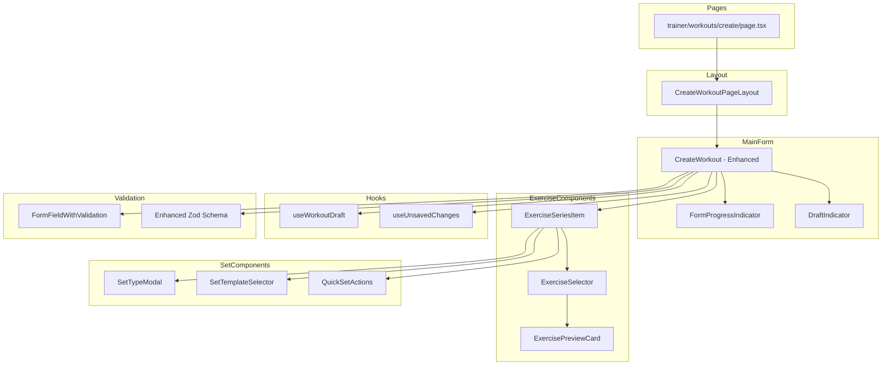

# Plan Ulepszenia Widoku Tworzenia Treningu

## 📋 Podsumowanie

Ten dokument opisuje plan ulepszenia widoku tworzenia treningu (`/trainer/workouts/create`) w celu poprawy UX, dodania walidacji i funkcji zapisywania jako szkic.

---

## 🔍 Analiza Obecnego Stanu

### Obecna Struktura Komponentów
```
src/app/(trainer)/trainer/workouts/create/page.tsx
  └── CreateWorkoutPageLayout
        └── CreateWorkout (główny komponent formularza)
              └── ExerciseSeriesItem (dla każdego ćwiczenia)
                    └── SetTypeModal/SetTypeButton (wybór typu serii)
```

### Zidentyfikowane Problemy UX

1. **Brak zapisywania szkiców** - użytkownik traci pracę przy nawigacji
2. **Ograniczona walidacja** - błędy pokazywane dopiero przy submit
3. **Brak wskaźnika postępu** - użytkownik nie wie ile zostało do zrobienia
4. **Skomplikowany UI dla serii** - grid layout może być mylący
5. **Brak podglądu ćwiczenia** - użytkownik nie widzi szczegółów przed dodaniem
6. **Brak szablonów/presetów** - każdy trening trzeba budować od zera
7. **Brak undo/redo** - błędy wymagają ręcznej korekty
8. **Brakujące pole opisu** - istnieje w modelu, ale nie w formularzu
9. **Brak potwierdzenia przed opuszczeniem** z niezapisanymi zmianami

---

## 🎯 Plan Ulepszeń

### Faza 1: Walidacja i Feedback (Priorytet: Wysoki)

#### 1.1 Ulepszona Walidacja Formularza

**Plik:** [`src/components/workouts/CreateWorkout.tsx`](src/components/workouts/CreateWorkout.tsx:26)

```typescript
// Rozszerzony schemat walidacji
const workoutSchema = z.object({
  name: z.string()
    .min(3, 'Nazwa musi mieć minimum 3 znaki')
    .max(100, 'Nazwa może mieć maksymalnie 100 znaków'),
  description: z.string()
    .max(500, 'Opis może mieć maksymalnie 500 znaków')
    .optional(),
  imageUrl: z.string()
    .url('Nieprawidłowy format URL')
    .optional()
    .or(z.literal('')),
  level: z.nativeEnum(TrainingLevel),
  durationMinutes: z.coerce.number()
    .min(5, 'Minimalny czas to 5 minut')
    .max(300, 'Maksymalny czas to 300 minut'),
  exerciseSeries: z.array(exerciseSeriesSchema)
    .min(1, 'Dodaj przynajmniej jedno ćwiczenie')
    .max(20, 'Maksymalnie 20 ćwiczeń w treningu'),
  status: z.enum(['draft', 'published']).default('draft'),
});

const workoutSetSchema = z.object({
  type: z.nativeEnum(SetType),
  reps: z.coerce.number()
    .min(1, 'Minimum 1 powtórzenie')
    .max(100, 'Maksymalnie 100 powtórzeń')
    .optional(),
  weight: z.coerce.number()
    .min(0, 'Ciężar nie może być ujemny')
    .max(500, 'Maksymalnie 500 kg')
    .optional(),
  duration: z.coerce.number()
    .min(1, 'Minimum 1 sekunda')
    .max(3600, 'Maksymalnie 1 godzina')
    .optional(),
  restTimeSeconds: z.coerce.number()
    .min(0, 'Przerwa nie może być ujemna')
    .max(600, 'Maksymalnie 10 minut przerwy'),
}).refine(data => {
  // Walidacja warunkowa - musi być reps, weight lub duration
  return data.reps || data.weight || data.duration;
}, { message: 'Wypełnij parametry serii' });
```

#### 1.2 Komponent Walidacji w Czasie Rzeczywistym

**Nowy plik:** `src/components/workout/FormFieldWithValidation.tsx`

```typescript
interface FormFieldWithValidationProps {
  label: string;
  error?: string;
  touched?: boolean;
  required?: boolean;
  hint?: string;
  children: React.ReactNode;
}

export function FormFieldWithValidation({
  label,
  error,
  touched,
  required,
  hint,
  children
}: FormFieldWithValidationProps) {
  const showError = touched && error;

  return (
    <div className="space-y-1.5">
      <Label className={cn(showError && "text-destructive")}>
        {label}
        {required && <span className="text-destructive ml-1">*</span>}
      </Label>
      {children}
      {hint && !showError && (
        <p className="text-xs text-muted-foreground">{hint}</p>
      )}
      {showError && (
        <p className="text-xs text-destructive flex items-center gap-1">
          <AlertCircle className="h-3 w-3" />
          {error}
        </p>
      )}
    </div>
  );
}
```

#### 1.3 Wskaźnik Kompletności Formularza

**Nowy komponent:** `src/components/workout/FormProgressIndicator.tsx`

```typescript
interface FormProgressIndicatorProps {
  steps: {
    label: string;
    isComplete: boolean;
    isActive: boolean;
  }[];
}

export function FormProgressIndicator({ steps }: FormProgressIndicatorProps) {
  const completedCount = steps.filter(s => s.isComplete).length;
  const progress = (completedCount / steps.length) * 100;

  return (
    <div className="space-y-2">
      <div className="flex justify-between text-sm">
        <span>Postęp formularza</span>
        <span className="text-muted-foreground">{completedCount}/{steps.length}</span>
      </div>
      <Progress value={progress} className="h-2" />
      <div className="flex gap-2 flex-wrap">
        {steps.map((step, i) => (
          <Badge
            key={i}
            variant={step.isComplete ? "default" : step.isActive ? "secondary" : "outline"}
          >
            {step.isComplete && <Check className="h-3 w-3 mr-1" />}
            {step.label}
          </Badge>
        ))}
      </div>
    </div>
  );
}
```

---

### Faza 2: Zapisywanie Szkiców (Priorytet: Wysoki)

#### 2.1 Hook do Zarządzania Szkicami

**Nowy plik:** `src/hooks/useWorkoutDraft.ts`

```typescript
interface WorkoutDraft {
  id?: string;
  data: WorkoutFormValues;
  lastSaved: Date;
  autoSaved: boolean;
}

export function useWorkoutDraft(draftId?: string) {
  const LOCAL_STORAGE_KEY = 'workout-draft';
  const AUTO_SAVE_DELAY = 30000; // 30 sekund

  const [draft, setDraft] = useState<WorkoutDraft | null>(null);
  const [isSaving, setIsSaving] = useState(false);
  const [lastAutoSave, setLastAutoSave] = useState<Date | null>(null);

  // Ładowanie szkicu z localStorage przy starcie
  useEffect(() => {
    const saved = localStorage.getItem(LOCAL_STORAGE_KEY);
    if (saved) {
      try {
        const parsed = JSON.parse(saved);
        setDraft(parsed);
      } catch (e) {
        console.error('Failed to parse draft:', e);
      }
    }
  }, []);

  // Auto-save do localStorage
  const autoSaveToLocal = useCallback((data: WorkoutFormValues) => {
    const draftData: WorkoutDraft = {
      data,
      lastSaved: new Date(),
      autoSaved: true,
    };
    localStorage.setItem(LOCAL_STORAGE_KEY, JSON.stringify(draftData));
    setLastAutoSave(new Date());
  }, []);

  // Zapisz szkic do bazy danych
  const saveDraftToDb = useCallback(async (data: WorkoutFormValues) => {
    setIsSaving(true);
    try {
      const response = await fetch('/api/db/workouts', {
        method: 'POST',
        headers: { 'Content-Type': 'application/json' },
        body: JSON.stringify({ ...data, status: 'draft' }),
      });

      if (response.ok) {
        const result = await response.json();
        localStorage.removeItem(LOCAL_STORAGE_KEY);
        return result.data.id;
      }
    } finally {
      setIsSaving(false);
    }
  }, []);

  // Wyczyść szkic
  const clearDraft = useCallback(() => {
    localStorage.removeItem(LOCAL_STORAGE_KEY);
    setDraft(null);
  }, []);

  // Sprawdź czy jest niezapisany szkic
  const hasUnsavedDraft = useCallback(() => {
    return localStorage.getItem(LOCAL_STORAGE_KEY) !== null;
  }, []);

  return {
    draft,
    isSaving,
    lastAutoSave,
    autoSaveToLocal,
    saveDraftToDb,
    clearDraft,
    hasUnsavedDraft,
  };
}
```

#### 2.2 Aktualizacja Modelu Workout

**Plik:** [`src/models/Workout.ts`](src/models/Workout.ts:1)

Dodać pole `status`:

```typescript
const WorkoutSchema = new Schema<IWorkout>({
  // ... istniejące pola
  status: {
    type: String,
    enum: ['draft', 'published'],
    default: 'published'
  },
});
```

#### 2.3 UI dla Szkiców

**Komponent:** `src/components/workout/DraftIndicator.tsx`

```typescript
interface DraftIndicatorProps {
  lastSaved?: Date;
  isSaving: boolean;
  onSaveDraft: () => void;
  onDiscardDraft: () => void;
}

export function DraftIndicator({
  lastSaved,
  isSaving,
  onSaveDraft,
  onDiscardDraft
}: DraftIndicatorProps) {
  return (
    <div className="flex items-center gap-4 p-3 bg-muted/50 rounded-lg border border-dashed">
      <div className="flex items-center gap-2">
        {isSaving ? (
          <Loader2 className="h-4 w-4 animate-spin text-muted-foreground" />
        ) : (
          <Save className="h-4 w-4 text-muted-foreground" />
        )}
        <span className="text-sm text-muted-foreground">
          {isSaving
            ? 'Zapisywanie...'
            : lastSaved
              ? `Ostatni zapis: ${formatDistanceToNow(lastSaved, { addSuffix: true, locale: pl })}`
              : 'Niezapisany szkic'
          }
        </span>
      </div>
      <div className="flex gap-2 ml-auto">
        <Button variant="outline" size="sm" onClick={onSaveDraft} disabled={isSaving}>
          <Save className="h-4 w-4 mr-1" />
          Zapisz szkic
        </Button>
        <Button variant="ghost" size="sm" onClick={onDiscardDraft}>
          <Trash2 className="h-4 w-4 mr-1" />
          Odrzuć
        </Button>
      </div>
    </div>
  );
}
```

---

### Faza 3: Ochrona Przed Utratą Danych (Priorytet: Wysoki)

#### 3.1 Hook do Wykrywania Niezapisanych Zmian

**Nowy plik:** `src/hooks/useUnsavedChanges.ts`

```typescript
export function useUnsavedChanges(hasChanges: boolean, message?: string) {
  const defaultMessage = 'Masz niezapisane zmiany. Czy na pewno chcesz opuścić stronę?';

  useEffect(() => {
    const handleBeforeUnload = (e: BeforeUnloadEvent) => {
      if (hasChanges) {
        e.preventDefault();
        e.returnValue = message || defaultMessage;
        return message || defaultMessage;
      }
    };

    window.addEventListener('beforeunload', handleBeforeUnload);
    return () => window.removeEventListener('beforeunload', handleBeforeUnload);
  }, [hasChanges, message]);

  // Hook do Next.js router
  const router = useRouter();
  const pathname = usePathname();

  useEffect(() => {
    const handleRouteChange = (url: string) => {
      if (hasChanges && url !== pathname) {
        const confirmed = window.confirm(message || defaultMessage);
        if (!confirmed) {
          router.push(pathname);
          throw 'Route change aborted';
        }
      }
    };

    // Nasłuchuj na zmiany routera
    window.addEventListener('popstate', () => handleRouteChange(window.location.pathname));

    return () => {
      window.removeEventListener('popstate', () => handleRouteChange(window.location.pathname));
    };
  }, [hasChanges, pathname, router, message]);
}
```

#### 3.2 Dialog Potwierdzenia

**Komponent:** `src/components/workout/UnsavedChangesDialog.tsx`

```typescript
interface UnsavedChangesDialogProps {
  open: boolean;
  onConfirm: () => void;
  onCancel: () => void;
  onSaveDraft: () => void;
}

export function UnsavedChangesDialog({
  open,
  onConfirm,
  onCancel,
  onSaveDraft,
}: UnsavedChangesDialogProps) {
  return (
    <AlertDialog open={open}>
      <AlertDialogContent>
        <AlertDialogHeader>
          <AlertDialogTitle>Niezapisane zmiany</AlertDialogTitle>
          <AlertDialogDescription>
            Masz niezapisane zmiany w formularzu. Co chcesz zrobić?
          </AlertDialogDescription>
        </AlertDialogHeader>
        <AlertDialogFooter className="flex-col sm:flex-row gap-2">
          <Button variant="outline" onClick={onCancel}>
            Wróć do edycji
          </Button>
          <Button variant="secondary" onClick={onSaveDraft}>
            <Save className="h-4 w-4 mr-2" />
            Zapisz jako szkic
          </Button>
          <Button variant="destructive" onClick={onConfirm}>
            Odrzuć zmiany
          </Button>
        </AlertDialogFooter>
      </AlertDialogContent>
    </AlertDialog>
  );
}
```

---

### Faza 4: Ulepszony Wybór Ćwiczeń (Priorytet: Średni)

#### 4.1 Rozszerzony Komponent Wyboru Ćwiczeń

**Nowy plik:** `src/components/workout/ExerciseSelector.tsx`

```typescript
interface ExerciseSelectorProps {
  exercises: Exercise[];
  selectedId?: string;
  onSelect: (exerciseId: string) => void;
}

export function ExerciseSelector({ exercises, selectedId, onSelect }: ExerciseSelectorProps) {
  const [search, setSearch] = useState('');
  const [filterMuscle, setFilterMuscle] = useState<MuscleGroupName | 'all'>('all');
  const [filterType, setFilterType] = useState<ExerciseType | 'all'>('all');
  const [previewExercise, setPreviewExercise] = useState<Exercise | null>(null);

  const filteredExercises = useMemo(() => {
    return exercises.filter(ex => {
      const matchesSearch = ex.name.toLowerCase().includes(search.toLowerCase());
      const matchesMuscle = filterMuscle === 'all' ||
        ex.mainMuscleGroups.some(mg => mg.name === filterMuscle);
      const matchesType = filterType === 'all' || ex.type === filterType;
      return matchesSearch && matchesMuscle && matchesType;
    });
  }, [exercises, search, filterMuscle, filterType]);

  return (
    <div className="space-y-4">
      {/* Filtry */}
      <div className="flex gap-2 flex-wrap">
        <Input
          placeholder="Szukaj ćwiczenia..."
          value={search}
          onChange={(e) => setSearch(e.target.value)}
          className="flex-1 min-w-[200px]"
        />
        <Select value={filterMuscle} onValueChange={setFilterMuscle}>
          <SelectTrigger className="w-[180px]">
            <SelectValue placeholder="Grupa mięśniowa" />
          </SelectTrigger>
          <SelectContent>
            <SelectItem value="all">Wszystkie grupy</SelectItem>
            {Object.values(MuscleGroupName).map(mg => (
              <SelectItem key={mg} value={mg}>{mg}</SelectItem>
            ))}
          </SelectContent>
        </Select>
        <Select value={filterType} onValueChange={setFilterType}>
          <SelectTrigger className="w-[150px]">
            <SelectValue placeholder="Typ" />
          </SelectTrigger>
          <SelectContent>
            <SelectItem value="all">Wszystkie typy</SelectItem>
            <SelectItem value="weight">Na ciężar</SelectItem>
            <SelectItem value="reps">Na powtórzenia</SelectItem>
            <SelectItem value="duration">Na czas</SelectItem>
          </SelectContent>
        </Select>
      </div>

      {/* Lista ćwiczeń */}
      <ScrollArea className="h-[300px] border rounded-md">
        <div className="p-2 space-y-1">
          {filteredExercises.map(exercise => (
            <div
              key={exercise.id}
              className={cn(
                "flex items-center gap-3 p-2 rounded-md cursor-pointer transition-colors",
                "hover:bg-secondary/50",
                selectedId === exercise.id && "bg-primary/10 border border-primary"
              )}
              onClick={() => onSelect(exercise.id)}
              onMouseEnter={() => setPreviewExercise(exercise)}
            >
              {exercise.mediaUrl && (
                
              )}
              <div className="flex-1 min-w-0">
                <p className="font-medium truncate">{exercise.name}</p>
                <div className="flex gap-1 flex-wrap">
                  {exercise.mainMuscleGroups.slice(0, 2).map(mg => (
                    <Badge key={mg.name} variant="secondary" className="text-xs">
                      {mg.name}
                    </Badge>
                  ))}
                </div>
              </div>
              <Button
                variant="ghost"
                size="icon"
                onClick={(e) => {
                  e.stopPropagation();
                  setPreviewExercise(exercise);
                }}
              >
                <Eye className="h-4 w-4" />
              </Button>
            </div>
          ))}
        </div>
      </ScrollArea>

      {/* Podgląd ćwiczenia */}
      {previewExercise && (
        <ExercisePreviewCard
          exercise={previewExercise}
          onClose={() => setPreviewExercise(null)}
          onSelect={() => {
            onSelect(previewExercise.id);
            setPreviewExercise(null);
          }}
        />
      )}
    </div>
  );
}
```

#### 4.2 Karta Podglądu Ćwiczenia

**Komponent:** `src/components/workout/ExercisePreviewCard.tsx`

```typescript
interface ExercisePreviewCardProps {
  exercise: Exercise;
  onClose: () => void;
  onSelect: () => void;
}

export function ExercisePreviewCard({ exercise, onClose, onSelect }: ExercisePreviewCardProps) {
  return (
    <Card className="border-2 border-primary/20">
      <CardHeader className="pb-2">
        <div className="flex justify-between items-start">
          <CardTitle className="text-lg">{exercise.name}</CardTitle>
          <Button variant="ghost" size="icon" onClick={onClose}>
            <X className="h-4 w-4" />
          </Button>
        </div>
      </CardHeader>
      <CardContent className="space-y-4">
        {exercise.mediaUrl && (
          <div className="aspect-video rounded-lg overflow-hidden bg-muted">
            
          </div>
        )}

        <div className="grid grid-cols-2 gap-4">
          <div>
            <Label className="text-xs text-muted-foreground">Główne mięśnie</Label>
            <div className="flex gap-1 flex-wrap mt-1">
              {exercise.mainMuscleGroups.map(mg => (
                <Badge key={mg.name}>{mg.name}</Badge>
              ))}
            </div>
          </div>
          <div>
            <Label className="text-xs text-muted-foreground">Pomocnicze mięśnie</Label>
            <div className="flex gap-1 flex-wrap mt-1">
              {exercise.secondaryMuscleGroups.map(mg => (
                <Badge key={mg.name} variant="outline">{mg.name}</Badge>
              ))}
            </div>
          </div>
        </div>

        {exercise.instructions && (
          <div>
            <Label className="text-xs text-muted-foreground">Instrukcje</Label>
            <p className="text-sm mt-1">{exercise.instructions}</p>
          </div>
        )}

        <Button onClick={onSelect} className="w-full">
          <Plus className="h-4 w-4 mr-2" />
          Dodaj do treningu
        </Button>
      </CardContent>
    </Card>
  );
}
```

---

### Faza 5: Ulepszenia Zarządzania Seriami (Priorytet: Średni)

#### 5.1 Szablony Serii

**Nowy plik:** `src/lib/set-templates.ts`

```typescript
export interface SetTemplate {
  id: string;
  name: string;
  description: string;
  sets: Omit<WorkoutSet, 'number'>[];
}

export const SET_TEMPLATES: SetTemplate[] = [
  {
    id: 'strength-5x5',
    name: '5x5 Siła',
    description: 'Klasyczny schemat siłowy - 5 serii po 5 powtórzeń',
    sets: [
      { type: SetType.WarmUpSet, reps: 10, weight: 0, restTimeSeconds: 60 },
      { type: SetType.WarmUpSet, reps: 5, weight: 0, restTimeSeconds: 90 },
      { type: SetType.WorkingSet, reps: 5, weight: 0, restTimeSeconds: 180 },
      { type: SetType.WorkingSet, reps: 5, weight: 0, restTimeSeconds: 180 },
      { type: SetType.WorkingSet, reps: 5, weight: 0, restTimeSeconds: 180 },
      { type: SetType.WorkingSet, reps: 5, weight: 0, restTimeSeconds: 180 },
      { type: SetType.WorkingSet, reps: 5, weight: 0, restTimeSeconds: 180 },
    ],
  },
  {
    id: 'hypertrophy-4x10',
    name: '4x10 Hipertrofia',
    description: 'Schemat na masę - 4 serie po 10 powtórzeń',
    sets: [
      { type: SetType.WarmUpSet, reps: 15, weight: 0, restTimeSeconds: 60 },
      { type: SetType.WorkingSet, reps: 10, weight: 0, restTimeSeconds: 90 },
      { type: SetType.WorkingSet, reps: 10, weight: 0, restTimeSeconds: 90 },
      { type: SetType.WorkingSet, reps: 10, weight: 0, restTimeSeconds: 90 },
      { type: SetType.WorkingSet, reps: 10, weight: 0, restTimeSeconds: 90 },
    ],
  },
  {
    id: 'pyramid',
    name: 'Piramida',
    description: 'Rosnący ciężar, malejące powtórzenia',
    sets: [
      { type: SetType.WarmUpSet, reps: 12, weight: 0, restTimeSeconds: 60 },
      { type: SetType.WorkingSet, reps: 10, weight: 0, restTimeSeconds: 90 },
      { type: SetType.WorkingSet, reps: 8, weight: 0, restTimeSeconds: 120 },
      { type: SetType.WorkingSet, reps: 6, weight: 0, restTimeSeconds: 150 },
      { type: SetType.WorkingSet, reps: 4, weight: 0, restTimeSeconds: 180 },
    ],
  },
  {
    id: 'dropset',
    name: 'Drop Set',
    description: 'Seria z obniżaniem ciężaru',
    sets: [
      { type: SetType.WarmUpSet, reps: 12, weight: 0, restTimeSeconds: 60 },
      { type: SetType.WorkingSet, reps: 8, weight: 0, restTimeSeconds: 120 },
      { type: SetType.DropSet, reps: 10, weight: 0, restTimeSeconds: 0 },
      { type: SetType.DropSet, reps: 12, weight: 0, restTimeSeconds: 0 },
      { type: SetType.DropSet, reps: 15, weight: 0, restTimeSeconds: 120 },
    ],
  },
];
```

#### 5.2 Komponent Wyboru Szablonu

**Komponent:** `src/components/workout/SetTemplateSelector.tsx`

```typescript
interface SetTemplateSelectorProps {
  onSelect: (template: SetTemplate) => void;
}

export function SetTemplateSelector({ onSelect }: SetTemplateSelectorProps) {
  return (
    <DropdownMenu>
      <DropdownMenuTrigger asChild>
        <Button variant="outline" size="sm">
          <Sparkles className="h-4 w-4 mr-2" />
          Użyj szablonu
        </Button>
      </DropdownMenuTrigger>
      <DropdownMenuContent align="end" className="w-[280px]">
        <DropdownMenuLabel>Szablony serii</DropdownMenuLabel>
        <DropdownMenuSeparator />
        {SET_TEMPLATES.map(template => (
          <DropdownMenuItem
            key={template.id}
            onClick={() => onSelect(template)}
            className="flex flex-col items-start py-2"
          >
            <span className="font-medium">{template.name}</span>
            <span className="text-xs text-muted-foreground">{template.description}</span>
          </DropdownMenuItem>
        ))}
      </DropdownMenuContent>
    </DropdownMenu>
  );
}
```

#### 5.3 Szybkie Akcje dla Serii

**Komponent:** `src/components/workout/QuickSetActions.tsx`

```typescript
interface QuickSetActionsProps {
  onAddSet: (type: SetType) => void;
  onDuplicateLast: () => void;
  onClearAll: () => void;
  setsCount: number;
}

export function QuickSetActions({
  onAddSet,
  onDuplicateLast,
  onClearAll,
  setsCount
}: QuickSetActionsProps) {
  return (
    <div className="flex gap-2 flex-wrap">
      <TooltipProvider>
        <Tooltip>
          <TooltipTrigger asChild>
            <Button
              variant="outline"
              size="sm"
              onClick={() => onAddSet(SetType.WorkingSet)}
            >
              <Plus className="h-4 w-4" />
            </Button>
          </TooltipTrigger>
          <TooltipContent>Dodaj serię roboczą</TooltipContent>
        </Tooltip>

        <Tooltip>
          <TooltipTrigger asChild>
            <Button
              variant="outline"
              size="sm"
              onClick={() => onAddSet(SetType.WarmUpSet)}
            >
              <Flame className="h-4 w-4" />
            </Button>
          </TooltipTrigger>
          <TooltipContent>Dodaj rozgrzewkę</TooltipContent>
        </Tooltip>

        <Tooltip>
          <TooltipTrigger asChild>
            <Button
              variant="outline"
              size="sm"
              onClick={onDuplicateLast}
              disabled={setsCount === 0}
            >
              <Copy className="h-4 w-4" />
            </Button>
          </TooltipTrigger>
          <TooltipContent>Duplikuj ostatnią serię</TooltipContent>
        </Tooltip>

        <Tooltip>
          <TooltipTrigger asChild>
            <Button
              variant="outline"
              size="sm"
              onClick={onClearAll}
              disabled={setsCount === 0}
              className="text-destructive hover:text-destructive"
            >
              <Trash2 className="h-4 w-4" />
            </Button>
          </TooltipTrigger>
          <TooltipContent>Usuń wszystkie serie</TooltipContent>
        </Tooltip>
      </TooltipProvider>
    </div>
  );
}
```

---

### Faza 6: Ulepszenia UI/UX (Priorytet: Niski)

#### 6.1 Drag & Drop dla Ćwiczeń

Użyć biblioteki `@dnd-kit/core` do przeciągania ćwiczeń:

```typescript
import { DndContext, closestCenter, DragEndEvent } from '@dnd-kit/core';
import { SortableContext, verticalListSortingStrategy } from '@dnd-kit/sortable';

// W komponencie CreateWorkout
<DndContext collisionDetection={closestCenter} onDragEnd={handleDragEnd}>
  <SortableContext items={exerciseFields.map(f => f.id)} strategy={verticalListSortingStrategy}>
    {exerciseFields.map((field, index) => (
      <SortableExerciseItem key={field.id} id={field.id} index={index} ... />
    ))}
  </SortableContext>
</DndContext>
```

#### 6.2 Animacje Przejść

Użyć `framer-motion` dla płynnych animacji:

```typescript
import { motion, AnimatePresence } from 'framer-motion';

<AnimatePresence>
  {exerciseFields.map((field, index) => (
    <motion.div
      key={field.id}
      initial={{ opacity: 0, y: 20 }}
      animate={{ opacity: 1, y: 0 }}
      exit={{ opacity: 0, x: -100 }}
      transition={{ duration: 0.2 }}
    >
      <ExerciseSeriesItem ... />
    </motion.div>
  ))}
</AnimatePresence>
```

---

## 📊 Diagram Architektury



---

## 📋 Plan Implementacji

### Sprint 1 (Tydzień 1-2): Fundamenty
| Zadanie | Priorytet | Estymacja |
|---------|-----------|-----------|
| Rozszerzona walidacja Zod | Wysoki | 2h |
| FormFieldWithValidation komponent | Wysoki | 2h |
| useWorkoutDraft hook | Wysoki | 4h |
| DraftIndicator komponent | Wysoki | 2h |
| Aktualizacja modelu Workout (status) | Wysoki | 1h |

### Sprint 2 (Tydzień 3-4): Ochrona Danych
| Zadanie | Priorytet | Estymacja |
|---------|-----------|-----------|
| useUnsavedChanges hook | Wysoki | 3h |
| UnsavedChangesDialog | Wysoki | 2h |
| FormProgressIndicator | Średni | 2h |
| Integracja z CreateWorkout | Wysoki | 4h |

### Sprint 3 (Tydzień 5-6): Wybór Ćwiczeń
| Zadanie | Priorytet | Estymacja |
|---------|-----------|-----------|
| ExerciseSelector komponent | Średni | 4h |
| ExercisePreviewCard | Średni | 2h |
| Filtry i wyszukiwanie | Średni | 3h |

### Sprint 4 (Tydzień 7-8): Serie i Szablony
| Zadanie | Priorytet | Estymacja |
|---------|-----------|-----------|
| SET_TEMPLATES konfiguracja | Średni | 2h |
| SetTemplateSelector | Średni | 2h |
| QuickSetActions | Średni | 2h |
| Integracja szablonów | Średni | 3h |

### Sprint 5 (Tydzień 9-10): Polish
| Zadanie | Priorytet | Estymacja |
|---------|-----------|-----------|
| Drag & Drop (@dnd-kit) | Niski | 4h |
| Animacje (framer-motion) | Niski | 3h |
| Testy E2E | Średni | 4h |
| Dokumentacja | Niski | 2h |

---

## 🔧 Wymagane Zależności

```json
{
  "dependencies": {
    "@dnd-kit/core": "^6.0.0",
    "@dnd-kit/sortable": "^7.0.0",
    "framer-motion": "^10.0.0",
    "date-fns": "^2.30.0"
  }
}
```

---

## ✅ Kryteria Akceptacji

1. **Walidacja**
   - [ ] Wszystkie pola mają walidację w czasie rzeczywistym
   - [ ] Błędy są wyświetlane natychmiast po opuszczeniu pola
   - [ ] Formularz nie może być wysłany z błędami

2. **Szkice**
   - [ ] Auto-save do localStorage co 30 sekund
   - [ ] Możliwość ręcznego zapisania szkicu do bazy
   - [ ] Przywracanie szkicu przy powrocie na stronę
   - [ ] Status "draft" widoczny na liście treningów

3. **Ochrona danych**
   - [ ] Ostrzeżenie przy próbie opuszczenia strony z niezapisanymi zmianami
   - [ ] Dialog z opcjami: wróć, zapisz szkic, odrzuć

4. **Wybór ćwiczeń**
   - [ ] Wyszukiwanie po nazwie
   - [ ] Filtrowanie po grupie mięśniowej i typie
   - [ ] Podgląd szczegółów ćwiczenia przed dodaniem

5. **Zarządzanie seriami**
   - [ ] Szablony serii (5x5, 4x10, piramida, drop set)
   - [ ] Szybkie akcje (dodaj, duplikuj, usuń)
   - [ ] Intuicyjny interfejs mobilny

---

## 📝 Notatki

- Komponent jest współdzielony między `/trainer`, `/athlete` i `/admin` - zmiany wpłyną na wszystkie role
- Należy zachować kompatybilność wsteczną z istniejącymi treningami
- Rozważyć migrację istniejących treningów do nowego schematu ze statusem