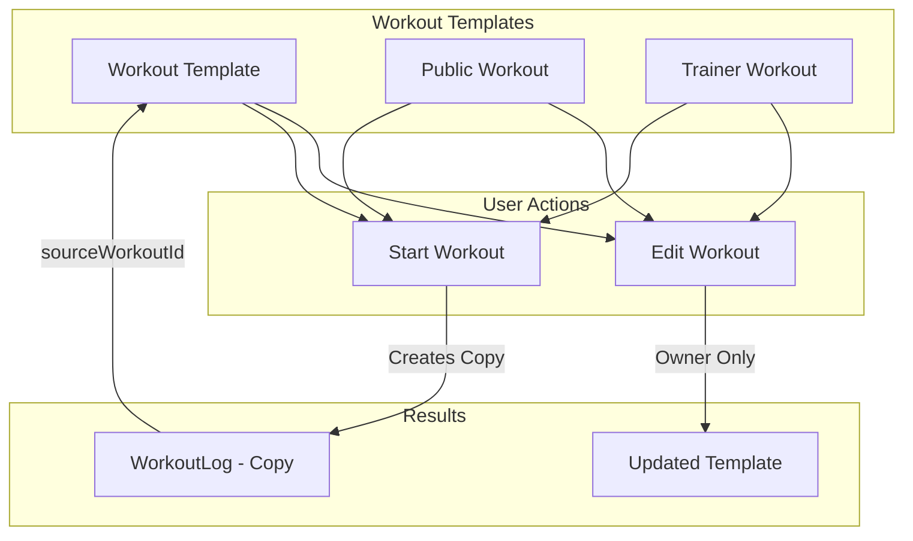

# Plan: Workout Editing Functionality

## Overview

This plan addresses the implementation of workout editing functionality for `/trainer/workouts` and `/athlete/workouts` pages. Currently, the "Edytuj" (Edit) button in the trainer view doesn't work because it's not wrapped in a Link component.

Additionally, this plan addresses the requirement that when a workout is started by a user, they should work on a **copy** of the workout, not the original. This ensures that the original workout template remains unchanged and can be reused by multiple people.

## Current State Analysis

### Issues Identified

1. **Non-functional Edit Button (Trainer)**: In [`WorkoutsListView.tsx:328-331`](src/components/shared/WorkoutsListView.tsx:328), the Edit button for trainer role is a plain `<Button>` without a `<Link>` wrapper, making it non-functional.

2. **Missing Edit Pages**: There are no edit pages for:
   - `/trainer/workouts/[id]` (trainer edit)
   - `/athlete/workouts/[id]/edit` (athlete edit for own workouts)

3. **No Workout Copy Mechanism**: When starting a workout, the system doesn't create a copy - it works directly with the workout template.

### Existing Components

| Component | Location | Purpose |
|-----------|----------|---------|
| [`WorkoutsListView`](src/components/shared/WorkoutsListView.tsx) | Shared | Lists workouts for trainer/athlete/admin |
| [`CreateWorkout`](src/components/workouts/CreateWorkout.tsx) | Workouts | Creates new workouts |
| [`CreateWorkoutPageLayout`](src/components/shared/CreateWorkoutPageLayout.tsx) | Shared | Layout wrapper for create pages |
| [`WorkoutForm`](src/components/admin/workout-form.tsx) | Admin | Admin workout form (simpler) |
| [`EditWorkoutPage`](src/app/(admin)/admin/workouts/[id]/page.tsx) | Admin | Admin edit page |

## Architecture

### Data Flow Diagram



### Component Architecture

```mermaid
flowchart TD
    subgraph Pages
        TP[/trainer/workouts/id/page.tsx]
        AP[/athlete/workouts/id/edit/page.tsx]
        ADP[/athlete/workouts/id/page.tsx]
    end

    subgraph SharedComponents
        EWPL[EditWorkoutPageLayout]
        EW[EditWorkout]
        CW[CreateWorkout - with edit mode]
    end

    subgraph Hooks
        UD[useDoc]
        UU[useUpdateDoc]
    end

    TP --> EWPL
    AP --> EWPL
    EWPL --> EW
    EW --> CW

    ADP -->|Edit Button| AP

    EW --> UD
    EW --> UU
```

## Implementation Plan

### Phase 1: Fix Edit Button in WorkoutsListView

**File**: [`src/components/shared/WorkoutsListView.tsx`](src/components/shared/WorkoutsListView.tsx)

**Change**: Wrap the trainer Edit button in a Link component (lines 328-331).

**Before**:
```tsx
<Button variant="outline" className="w-full">
    {cardActionText ?? defaultCardActionText}
</Button>
```

**After**:
```tsx
<Link href={`${detailsBasePath}/${workout.id}`} className="w-full">
    <Button variant="outline" className="w-full">
        <Edit className="mr-2 h-3 w-3" />
        {cardActionText ?? defaultCardActionText}
    </Button>
</Link>
```

### Phase 2: Create EditWorkout Component

**File**: `src/components/workouts/EditWorkout.tsx`

This component will be similar to [`CreateWorkout`](src/components/workouts/CreateWorkout.tsx) but:
- Accepts `workoutId` prop to load existing workout
- Uses `useUpdateDoc` instead of `useCreateDoc`
- Pre-populates form with existing workout data
- Changes button text to "Zapisz zmiany" (Save changes)

**Key differences from CreateWorkout**:
1. Loads existing workout data via `useDoc`
2. Maps `exerciseSeries` to form format (exercise.id → exerciseId)
3. Uses `updateDoc` for saving
4. No draft functionality needed (or optional)

### Phase 3: Create EditWorkoutPageLayout

**File**: `src/components/shared/EditWorkoutPageLayout.tsx`

Similar to [`CreateWorkoutPageLayout`](src/components/shared/CreateWorkoutPageLayout.tsx) but for editing:

```tsx
interface EditWorkoutPageLayoutProps {
    workoutId: string;
    backHref: string;
    redirectPath: string;
    title?: string;
    description?: string;
}
```

### Phase 4: Create Trainer Edit Page

**File**: `src/app/(trainer)/trainer/workouts/[id]/page.tsx`

```tsx
import { EditWorkoutPageLayout } from '@/components/shared/EditWorkoutPageLayout';

export default function TrainerEditWorkoutPage({ params }: { params: { id: string } }) {
    return (
        <EditWorkoutPageLayout
            workoutId={params.id}
            backHref="/trainer/workouts"
            redirectPath="/trainer/workouts"
            description="Edytuj plan treningowy."
        />
    );
}
```

### Phase 5: Create Athlete Edit Page

**File**: `src/app/(athlete)/athlete/workouts/[id]/edit/page.tsx`

Similar to trainer edit page but with athlete-specific paths.

### Phase 6: Update Athlete Workout Details Page

**File**: [`src/app/(athlete)/athlete/workouts/[id]/page.tsx`](src/app/(athlete)/athlete/workouts/[id]/page.tsx)

Add an Edit button that:
- Only shows for workouts owned by the current user (`workout.ownerId === user.uid`)
- Links to `/athlete/workouts/[id]/edit`

### Phase 7: Implement Workout Copy Mechanism

**File**: [`src/app/(athlete)/athlete/log/page.tsx`](src/app/(athlete)/athlete/log/page.tsx)

When starting a workout from a template:

1. **Add `sourceWorkoutId` to WorkoutLog**: Track which workout template was used
2. **Copy workout data**: The current implementation already copies the workout data into the log, but we should explicitly track the source

**Update WorkoutLog interface** in [`src/models/types/workout.ts`](src/models/types/workout.ts):

```tsx
export interface WorkoutLog {
  id: string;
  // ... existing fields
  sourceWorkoutId?: string; // NEW: Reference to original workout template
}
```

**Update log creation** in [`ActiveWorkoutView`](src/app/(athlete)/athlete/log/page.tsx:299-352):

```tsx
const initialLogData = {
    workoutName: initialWorkout.workoutName,
    exercises: exercisesWithNames,
    status: 'in-progress',
    startTime: startTime,
    athleteId: user.uid,
    sourceWorkoutId: workoutId || undefined, // NEW: Track source workout
};
```

## File Changes Summary

| File | Action | Description |
|------|--------|-------------|
| `src/components/shared/WorkoutsListView.tsx` | Modify | Fix Edit button link for trainer role |
| `src/components/workouts/EditWorkout.tsx` | Create | New edit workout component |
| `src/components/shared/EditWorkoutPageLayout.tsx` | Create | New layout for edit pages |
| `src/app/(trainer)/trainer/workouts/[id]/page.tsx` | Create | Trainer edit page |
| `src/app/(athlete)/athlete/workouts/[id]/edit/page.tsx` | Create | Athlete edit page |
| `src/app/(athlete)/athlete/workouts/[id]/page.tsx` | Modify | Add Edit button for own workouts |
| `src/models/types/workout.ts` | Modify | Add sourceWorkoutId to WorkoutLog |
| `src/app/(athlete)/athlete/log/page.tsx` | Modify | Track sourceWorkoutId when starting workout |

## Permission Model

| Role | Can Edit | Condition |
|------|----------|-----------|
| Trainer | Yes | Own workouts (`ownerId === user.uid`) |
| Athlete | Yes | Own workouts (`ownerId === user.uid`) |
| Athlete | Copy & Edit | Public workouts (`ownerId === 'public'`) - creates a copy |
| Athlete | Copy & Edit | Trainer's workouts - creates a copy |
| Admin | Yes | All workouts |

### Copy & Edit Flow for Non-Owned Workouts

When an athlete wants to edit a workout they don't own:
1. Show "Skopiuj i edytuj" (Copy & Edit) button instead of "Edytuj"
2. Create a copy of the workout with `ownerId` set to the athlete's `user.uid`
3. Redirect to the edit page for the new copy
4. The original workout remains unchanged

### Phase 8: Implement Copy & Edit for Non-Owned Workouts

**File**: `src/app/(athlete)/athlete/workouts/[id]/page.tsx`

Add a "Skopiuj i edytuj" button for non-owned workouts that:
1. Creates a copy of the workout via API
2. Sets `ownerId` to current user
3. Redirects to `/athlete/workouts/[newId]/edit`

**Implementation**:
```tsx
const handleCopyAndEdit = async () => {
    const newWorkout = {
        ...workout,
        id: undefined, // Let DB generate new ID
        ownerId: user.uid,
        name: `${workout.name} (kopia)`,
    };
    const result = await createDoc('workouts', newWorkout);
    router.push(`/athlete/workouts/${result.id}/edit`);
};
```

## Testing Checklist

- [ ] Trainer can click Edit button and navigate to edit page
- [ ] Trainer can edit and save workout changes
- [ ] Athlete can see Edit button only for own workouts
- [ ] Athlete can edit and save own workout changes
- [ ] Athlete cannot edit public or trainer workouts
- [ ] Starting a workout creates a WorkoutLog with sourceWorkoutId
- [ ] Original workout template remains unchanged after workout session
- [ ] Multiple users can start the same workout template simultaneously

## Notes

1. **Existing Copy Behavior**: The current implementation in [`log/page.tsx`](src/app/(athlete)/athlete/log/page.tsx) already copies workout data into the WorkoutLog. The exercises are stored as snapshots, not references. This means the original workout is already protected from modifications during a session.

2. **sourceWorkoutId Purpose**: Adding `sourceWorkoutId` allows:
   - Tracking which template was used
   - Analytics on workout template usage
   - Potential future features like "workout history for this template"

3. **Form Reuse Strategy**: Instead of duplicating the entire [`CreateWorkout`](src/components/workouts/CreateWorkout.tsx) component, we can:
   - Option A: Add an `editMode` prop to CreateWorkout
   - Option B: Create a shared form component used by both Create and Edit
   - **Recommended**: Option A for simplicity, as the form logic is identical

## Questions for User

1. Should athletes be able to edit public workouts by creating a copy? (Currently: No)
2. Should there be a "Duplicate" feature to copy a workout template? (Currently: Not planned)
3. Should the Edit button be visible but disabled for non-owned workouts with a tooltip? (Currently: Hidden)