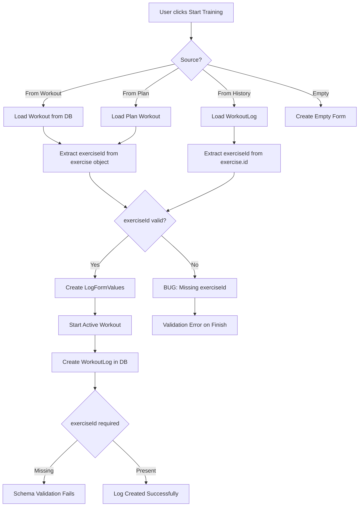

# Workout Training Bug Analysis

## Problem Description

When starting a training session from a previously created workout (e.g., `/athlete/workouts/692dcfa47f1d4c3883da84f4`) and trying to finish it, the user gets validation errors:
- `exerciseSeries, exerciseId required type invalid_type error`

However, if the user removes exercises from that workout and adds them again from the workout details page, they can finish the training without problems.

## Root Cause Analysis

### Data Structure Mismatch

The issue stems from a **data structure mismatch** between how exercises are stored in the `workouts` collection versus how they are expected in the `workoutLogs` collection.

#### Workout Collection Structure (`workouts`)

In the [`workouts`](src/models/Workout.ts:24-40) collection, exercises are stored with the **full exercise object embedded** in the `exerciseSeries` array:

```javascript
{
  "exerciseSeries": [
    {
      "exercise": {
        "_id": "692af227ab8e02665d85966e",  // String ID stored in _id field
        "name": "Waga",
        "mainMuscleGroups": [...],
        // ... other exercise fields
        "id": "692af227ab8e02665d85966e"    // Also has 'id' field
      },
      "tempo": "",
      "tip": "",
      "sets": [...]
    }
  ]
}
```

**Key observation**: The exercise object has `_id` as a string, and also has an `id` field.

#### WorkoutLog Collection Structure (`workoutlogs`)

In the [`workoutLogs`](src/models/WorkoutLog.ts:64-70) collection, the schema **requires** both:
1. `exerciseId` - a separate string field (required)
2. `exercise` - the embedded exercise snapshot (required)

```javascript
const ExerciseSeriesSchema = new Schema<IExerciseSeries>({
  exerciseId: { type: String, required: true },  // REQUIRED!
  exercise: { type: ExerciseSnapshotSchema, required: true },
  tempo: { type: String, default: "2-0-2-0" },
  tip: { type: String },
  sets: [WorkoutSetSchema]
});
```

### The Bug Location

The bug is in [`src/app/(athlete)/athlete/log/page.tsx`](src/app/(athlete)/athlete/log/page.tsx:1363-1398) in the `useEffect` that auto-starts the builder when a `workoutId` is present:

```typescript
// Line 1366-1395
exerciseSeries: preselectedWorkout.exerciseSeries.map(series => {
  let exerciseId = series.exercise.id || (series.exercise as any)._id;

  // Try to find by name if ID is missing
  if (!exerciseId && allExercises) {
    const found = allExercises.find(e => e.name === series.exercise.name);
    if (found) exerciseId = found.id;
  }

  // Fallback to temp ID if still missing
  if (!exerciseId) {
    console.warn(`Missing ID for exercise: ${series.exercise.name}, generating temp ID`);
    exerciseId = `temp-${Date.now()}-${Math.random().toString(36).substr(2, 9)}`;
  }

  return {
    exerciseId: exerciseId,
    // ...
  };
});
```

**The problem**: When `series.exercise.id` is `undefined` and `series.exercise._id` is a string like `"692af227ab8e02665d85966e"`, the code should work. However, looking at the database data:

```javascript
"exercise": {
  "_id": "692af227ab8e02665d85966e",
  // ...
  "id": "692af227ab8e02665d85966e"  // This field exists!
}
```

The issue is that when the workout is loaded from the database, the `id` field might not be properly mapped or the `_id` field is not being accessed correctly.

### Evidence from Database

Looking at the workout logs in the database, we can see the difference:

**Working logs (with exerciseId)**:
```javascript
{
  "exerciseId": "692acf8855187198aac3746b",
  "exercise": {
    "_id": "692acf8855187198aac3746b",
    "name": "Rozpiętki",
    // ...
  }
}
```

**Failing logs (missing exerciseId)**:
```javascript
{
  // NO exerciseId field!
  "exercise": {
    "name": "Unknown Exercise",
    "mainMuscleGroups": [],
    // ...
  }
}
```

### Why Adding Exercises from Details Page Works

When exercises are added from the workout details page using the [`AddExerciseSheet`](src/app/(athlete)/athlete/log/page.tsx:75-137) component, the `exerciseId` is explicitly passed:

```typescript
const handleAddExercise = (exerciseId: string) => {
  // exerciseId is explicitly passed from the exercise selection
  append({ exerciseId, sets: defaultSets, tempo: "2-0-2-0" });
};
```

This ensures the `exerciseId` is always a valid string.

## Affected Code Paths

1. **Auto-start from workout URL** ([`log/page.tsx:1360-1400`](src/app/(athlete)/athlete/log/page.tsx:1360-1400))
   - When navigating to `/athlete/log?workoutId=XXX`
   - The `exerciseId` extraction from `series.exercise.id` or `series.exercise._id` may fail

2. **Starting workout from plans** ([`log/page.tsx:1083-1103`](src/app/(athlete)/athlete/log/page.tsx:1083-1103))
   - `handleStartWorkout` function uses `series.exercise.id`
   - Same potential issue

3. **Repeating workout from history** ([`log/page.tsx:1105-1125`](src/app/(athlete)/athlete/log/page.tsx:1105-1125))
   - `handleRepeatWorkout` uses `ex.exercise.id`
   - May have the same issue if the original log was created with missing exerciseId

4. **Resume active workout** ([`log/page.tsx:1330-1356`](src/app/(athlete)/athlete/log/page.tsx:1330-1356))
   - Uses `ex.exercise.id` which could be undefined

## Solution Plan

### Phase 1: Fix the ID Extraction Logic

Update the ID extraction to handle all possible cases:

```typescript
const getExerciseId = (exercise: any): string => {
  // Try multiple possible ID locations
  const id = exercise.id || exercise._id || exercise.exerciseId;

  if (id) {
    // Handle ObjectId objects
    return typeof id === 'object' && id.toString ? id.toString() : String(id);
  }

  return '';
};
```

### Phase 2: Fix All Affected Code Paths

1. **Update `handleStartWorkout`** in WorkoutSelectionView
2. **Update `handleRepeatWorkout`** in WorkoutSelectionView
3. **Update auto-start useEffect** in LogWorkoutPage
4. **Update resume active workout useEffect** in LogWorkoutPage

### Phase 3: Add Validation Before Creating WorkoutLog

Add validation in [`ActiveWorkoutView`](src/app/(athlete)/athlete/log/page.tsx:302-353) before creating the initial workout log:

```typescript
// Validate that all exercises have valid IDs
const invalidExercises = initialWorkout.exerciseSeries.filter(
  series => !series.exerciseId || series.exerciseId.startsWith('temp-')
);

if (invalidExercises.length > 0) {
  toast({
    title: 'Błąd',
    description: 'Niektóre ćwiczenia nie mają prawidłowych identyfikatorów.',
    variant: 'destructive',
  });
  return;
}
```

### Phase 4: Fix Database Schema Consistency

Consider updating the [`Workout`](src/models/Workout.ts:24-40) model to store `exerciseId` separately, similar to WorkoutLog:

```typescript
exerciseSeries: [
  {
    exerciseId: { type: String, required: true }, // Add this field
    exercise: { type: Schema.Types.Mixed, required: true },
    tempo: { type: String },
    tip: { type: String },
    sets: [...]
  }
]
```

### Phase 5: Data Migration Script

Create a migration script to fix existing workouts that don't have proper exercise IDs:

```javascript
// scripts/fix-workout-exercise-ids.js
db.workouts.find({}).forEach(workout => {
  const updatedSeries = workout.exerciseSeries.map(series => {
    const exerciseId = series.exercise.id || series.exercise._id;
    return {
      ...series,
      exerciseId: exerciseId ? String(exerciseId) : null
    };
  });

  db.workouts.updateOne(
    { _id: workout._id },
    { $set: { exerciseSeries: updatedSeries } }
  );
});
```

## Implementation Priority

1. **HIGH**: Fix ID extraction logic in all code paths (Phase 1 & 2)
2. **MEDIUM**: Add validation before creating WorkoutLog (Phase 3)
3. **LOW**: Update database schema for consistency (Phase 4)
4. **LOW**: Data migration for existing records (Phase 5)

## Files to Modify

| File | Changes |
|------|---------|
| [`src/app/(athlete)/athlete/log/page.tsx`](src/app/(athlete)/athlete/log/page.tsx) | Fix ID extraction in multiple locations |
| [`src/models/Workout.ts`](src/models/Workout.ts) | Add exerciseId field to schema (optional) |
| `scripts/fix-workout-exercise-ids.js` | New migration script |

## Specific Code Changes Required

### 1. Create Helper Function (add after line 42)

Add a helper function at the top of the file to consistently extract exercise IDs:

```typescript
// --- HELPER FUNCTIONS ---
/**
 * Extracts exercise ID from various possible locations in an exercise object.
 * Handles cases where ID might be in 'id', '_id', or as an ObjectId.
 */
const getExerciseId = (exercise: any): string => {
  if (!exercise) return '';

  // Try standard id field first
  if (exercise.id && typeof exercise.id === 'string') {
    return exercise.id;
  }

  // Try _id field (MongoDB format)
  if (exercise._id) {
    // Handle ObjectId objects that have toString method
    if (typeof exercise._id === 'object' && exercise._id.toString) {
      return exercise._id.toString();
    }
    if (typeof exercise._id === 'string') {
      return exercise._id;
    }
  }

  // Try exerciseId field (WorkoutLog format)
  if (exercise.exerciseId && typeof exercise.exerciseId === 'string') {
    return exercise.exerciseId;
  }

  return '';
};
```

### 2. Fix handleStartWorkout (line 1083-1103)

**Current code:**
```typescript
exerciseSeries: workout.exerciseSeries.map(series => ({
  exerciseId: series.exercise.id,  // BUG: may be undefined
  // ...
})),
```

**Fixed code:**
```typescript
exerciseSeries: workout.exerciseSeries.map(series => ({
  exerciseId: getExerciseId(series.exercise),
  // ...
})),
```

### 3. Fix handleRepeatWorkout (line 1105-1125)

**Current code:**
```typescript
exerciseSeries: log.exercises.map(ex => ({
  exerciseId: ex.exercise.id,  // BUG: may be undefined
  // ...
})),
```

**Fixed code:**
```typescript
exerciseSeries: log.exercises.map(ex => ({
  exerciseId: getExerciseId(ex.exercise) || ex.exerciseId,  // Fallback to ex.exerciseId
  // ...
})),
```

### 4. Fix auto-start useEffect (line 1360-1400)

**Current code (line 1367):**
```typescript
let exerciseId = series.exercise.id || (series.exercise as any)._id;
```

**Fixed code:**
```typescript
let exerciseId = getExerciseId(series.exercise);
```

### 5. Fix resume active workout useEffect (line 1330-1356)

**Current code (line 1333):**
```typescript
exerciseSeries: activeLog.exercises.map(ex => ({
  exerciseId: ex.exercise.id,  // BUG: may be undefined
  // ...
})),
```

**Fixed code:**
```typescript
exerciseSeries: activeLog.exercises.map(ex => ({
  exerciseId: getExerciseId(ex.exercise) || ex.exerciseId,  // Fallback to ex.exerciseId
  // ...
})),
```

### 6. Add Validation in ActiveWorkoutView (before line 302)

Add validation before creating the workout log:

```typescript
const createInitialWorkoutLog = async () => {
  // Validate that all exercises have valid IDs
  const invalidExercises = initialWorkout.exerciseSeries.filter(
    series => !series.exerciseId || series.exerciseId.startsWith('temp-')
  );

  if (invalidExercises.length > 0) {
    console.error('Invalid exercises found:', invalidExercises);
    toast({
      title: 'Błąd',
      description: 'Niektóre ćwiczenia nie mają prawidłowych identyfikatorów. Spróbuj dodać je ponownie.',
      variant: 'destructive',
    });
    onFinishWorkout();
    return;
  }

  // ... rest of the function
};
```

## Testing Checklist

- [ ] Start training from existing workout with embedded exercises
- [ ] Start training from workout plan
- [ ] Repeat training from history
- [ ] Resume in-progress training
- [ ] Add exercises during active training
- [ ] Complete training and verify data in workoutLogs
- [ ] Verify all exercise IDs are properly stored

## Mermaid Diagram - Data Flow



## Mermaid Diagram - Fix Implementation

```mermaid
flowchart LR
    subgraph Current Flow
        A1[exercise.id] --> B1{undefined?}
        B1 -->|Yes| C1[exercise._id]
        C1 --> D1{undefined?}
        D1 -->|Yes| E1[Generate temp ID]
        D1 -->|No| F1[Use _id]
        B1 -->|No| F1
    end

    subgraph Fixed Flow
        A2[getExerciseId helper] --> B2[Try exercise.id]
        B2 --> C2[Try exercise._id]
        C2 --> D2[Try exercise.exerciseId]
        D2 --> E2[Handle ObjectId toString]
        E2 --> F2{Valid ID?}
        F2 -->|Yes| G2[Return ID string]
        F2 -->|No| H2[Show error to user]
    end